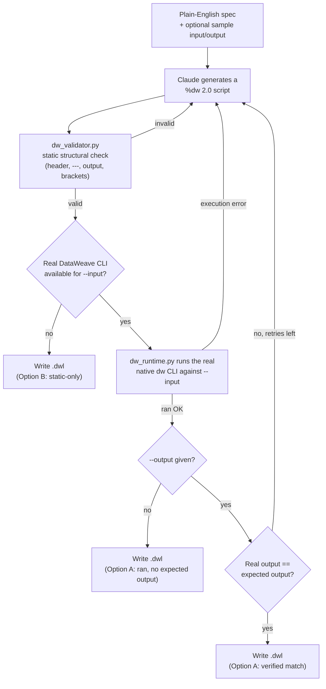
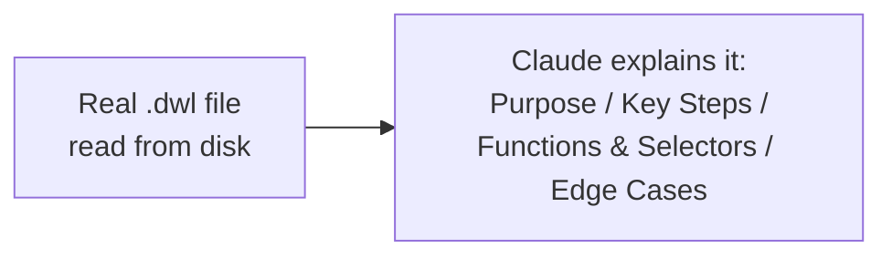
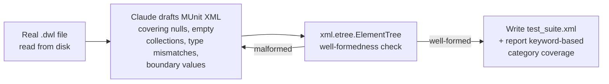

# dataweave-copilot

An AI copilot for MuleSoft **DataWeave 2.0**: describe a transformation in
plain English and get a real `.dwl` script back, hand a script to it and
get a structured plain-English explanation, or hand it a script and get a
MUnit-style edge-case test suite written for you.

```
dataweave-copilot generate  --spec "..." --input in.json --output out.json --out transform.dwl
dataweave-copilot explain   transform.dwl
dataweave-copilot gen-tests transform.dwl --out test_suite.xml
```

## Execution verification: Option A (real DataWeave execution) -- implemented

The spec for this project asked me to research current DataWeave 2.0
syntax and figure out whether real `.dwl` scripts could actually be
*executed* in this environment (Option A) before falling back to
structural-validation-only (Option B). **Option A worked.**

**Research, 2026-09-13:**

- [`docs.mulesoft.com/dataweave/latest/dataweave-language-introduction`](https://docs.mulesoft.com/dataweave/latest/dataweave-language-introduction),
  [`.../dataweave-selectors`](https://docs.mulesoft.com/dataweave/latest/dataweave-selectors),
  [`.../dataweave-flow-control`](https://docs.mulesoft.com/dataweave/latest/dataweave-flow-control),
  [`.../dw-core-functions-map`](https://docs.mulesoft.com/dataweave/latest/dw-core-functions-map),
  [`.../dw-core-functions-reduce`](https://docs.mulesoft.com/dataweave/latest/dw-core-functions-reduce),
  [`.../dataweave-cookbook`](https://docs.mulesoft.com/dataweave/latest/dataweave-cookbook) --
  confirmed current header syntax (`%dw 2.0` / `output application/json`),
  `var`/`fun`/`---`, selectors (`.`, `[]`, `*`, `..`), `map`/`filter`/`reduce`,
  `if`/`else if`/`else`, and `do { var ... --- expr }` blocks, with verbatim
  examples pulled from the live docs.
- The official engine repo, `mulesoft/data-weave`, turned out not to be
  the useful lead -- it's Scala/sbt source with no bundled portable CLI
  reachable from here. Its sibling repo, **[`mulesoft/data-weave-cli`](https://github.com/mulesoft/data-weave-cli)**,
  is: it publishes **self-contained, JVM-free native binaries** (built with
  GraalVM `native-image`) on its GitHub Releases page -- e.g.
  `dw-cli-2.12.0-macos-arm64.zip` -- for macOS (arm64), Linux (x86_64), and
  Windows (x86_64). No JDK/Maven install was needed anywhere in this
  process.
- [`docs.mulesoft.com/munit/latest/munit-test-concept`](https://docs.mulesoft.com/munit/latest/munit-test-concept)
  confirmed the current MUnit XML shape (`<munit:test>` /
  `<munit:execution>` / `<munit:validation>`) used by `gen-tests` below.

The binary was downloaded and actually used, for real, during development:

```
$ ./bin/dw run -s -f transform.dwl -i payload=sample_input.json
{
  "orderId": "ORD-1001",
  "customerName": "Ada Lovelace",
  ...
  "subtotal": 59.97,
  "tax": 4.8,
  "total": 64.77
}
```

`dataweave_copilot/dw_runtime.py` downloads that same binary on first use
(cached under `~/.cache/dataweave-copilot/`, override with
`DATAWEAVE_COPILOT_CACHE`) and shells out to it, so `generate` **actually
runs** every generated script against your `--input` file and, if you gave
one, diffs its real output against `--output`, feeding the real DataWeave
engine error or the real diff back into the prompt and retrying (up to
`--max-attempts`, default 3) when it doesn't match.

If your platform has no published binary, or the one-off download fails
(no network), `generate` **falls back automatically to Option B**: static
structural validation only (`dw_validator.py` -- checks the `%dw` header,
the `output` directive, the `---` separator, and bracket balance), and
says so explicitly in its output. That check always runs first regardless,
as a fast sanity pass before any real execution is attempted.

`explain` and `gen-tests` never execute DataWeave or Mule at all -- see
their sections below for exactly what *is* verified about their output.

## How it works







## Quickstart

```bash
git clone <this-repo> dataweave-copilot
cd dataweave-copilot
python3 -m venv .venv && source .venv/bin/activate
pip install -e ".[dev]"
export ANTHROPIC_API_KEY=sk-ant-...   # or `ant auth login`
```

Run the bundled example (`examples/orders_to_invoice/`: a plain-English
spec, a sample order, and a hand-verified expected invoice):

```bash
dataweave-copilot generate \
  --spec examples/orders_to_invoice/spec.txt \
  --input examples/orders_to_invoice/sample_input.json \
  --output examples/orders_to_invoice/sample_output.json \
  --out examples/orders_to_invoice/transform.dwl

dataweave-copilot explain examples/orders_to_invoice/transform.dwl

dataweave-copilot gen-tests examples/orders_to_invoice/transform.dwl \
  --out examples/orders_to_invoice/test_suite.xml
```

### What actually ran, in this environment, right now

This development environment has **no `ANTHROPIC_API_KEY`, no
`ANTHROPIC_AUTH_TOKEN`, and no `ant` CLI/OAuth profile** (checked: `ant`
is not installed; both env vars are unset). Per this project's own
disclosure standard (see `agent-demoforge`, another repo by this author),
here's exactly what that means was real and what wasn't for the run
captured below:

- **Real:** `dw_validator.py`'s static structural checks; downloading and
  running the actual native `dw` CLI against the real sample input;
  comparing its real stdout to the real expected-output file;
  `xml.etree.ElementTree` well-formedness parsing of the generated XML;
  the keyword-based edge-case category scan.
- **Stubbed:** the three `client.messages.create(...)` calls. A small
  harness swapped in a fake Anthropic client that returns fixed text
  instead of calling the real API, then ran the **exact same**
  `generator.generate()` / `explainer.explain()` / `test_generator.generate_tests()`
  code the real CLI uses. The "model output" fed in for `generate` is the
  literal DataWeave script that was hand-verified against
  `sample_input.json` / `sample_output.json` using the real `dw` CLI
  during development (see the Option A section above) -- so the
  real-execution verification step below was not rigged to trivially
  pass; the script still had to actually produce byte-for-byte the same
  real DataWeave output.

Captured console output:

```
$ dataweave-copilot generate --spec examples/orders_to_invoice/spec.txt --input examples/orders_to_invoice/sample_input.json --output examples/orders_to_invoice/sample_output.json --out examples/orders_to_invoice/transform.dwl
----------------------------------------------------------------------
Wrote examples/orders_to_invoice/transform.dwl
Verification mode: real-execution
Attempts made: 1
  attempt 1: static_valid=True executed=True execution_success=True output_matched=True
Result: PASSED verification

Verified via REAL DataWeave execution against --input and matched --output exactly.
----------------------------------------------------------------------
[exit code: 0]

$ dataweave-copilot explain examples/orders_to_invoice/transform.dwl
----------------------------------------------------------------------
Overall Purpose
This script converts an order document (an orderId, a customer, and a list
of line items) into an invoice: it drops cancelled line items, computes a
per-line total, sums those into a subtotal, applies 8% tax, and rounds all
monetary values to 2 decimal places.

Key Steps
1. `payload.lineItems filter ($.status != "cancelled")` removes any line
   item whose status is "cancelled" before anything else happens.
2. `activeItems reduce ((item, acc = 0) -> acc + (item.quantity * item.unitPrice))`
   sums quantity*unitPrice across the surviving line items into `subtotal`.
3. `tax` is computed as 8% of `subtotal`, and `total` as `subtotal + tax`.
4. Every monetary value is passed through `round(x * 100) / 100` (from
   `dw::core::Numbers`) to force 2-decimal-place rounding, since floating
   point multiplication (e.g. 0.08 tax) can otherwise produce values like
   4.7976 instead of 4.8.
5. The final `do { ... }` block builds the invoice object: orderId,
   customerName (via `payload.customer.name`), the filtered+mapped
   lineItems (each with a computed lineTotal), subtotal, tax, and total.

Notable Functions & Selectors
- `filter` and `map` on the lineItems array.
- `reduce` with an explicit initial accumulator value (`acc = 0`) to sum
  line totals.
- The `.` selector chain (`payload.customer.name`, `item.unitPrice`, ...).
- `import * from dw::core::Numbers` to bring `round` into scope.
- A `do { var ... --- expr }` block to compute intermediate named values
  (activeItems, subtotal, tax, total) before building the final object.

Edge Cases It May Not Handle Well
- If `payload.lineItems` is missing or not an array, `filter` will error
  rather than degrade gracefully to an empty invoice.
- If every line item is cancelled, `activeItems` is `[]` and `reduce`
  without a lambda-level guard for the empty case relies on the explicit
  `acc = 0` initial value to avoid erroring -- that works here, but it's
  worth calling out as the reason this script doesn't blow up on an
  all-cancelled order.
- `status` values are compared with a strict `!=` -- unexpected casing
  (e.g. "Cancelled") or null status would NOT be excluded, since neither
  equals the literal string "cancelled".
- Negative `quantity` or `unitPrice` values are not validated and would
  silently produce a negative lineTotal/subtotal.
----------------------------------------------------------------------
[exit code: 0]

$ dataweave-copilot gen-tests examples/orders_to_invoice/transform.dwl --out examples/orders_to_invoice/test_suite.xml
----------------------------------------------------------------------
Wrote examples/orders_to_invoice/test_suite.xml
Well-formed XML: True (attempts: 1)
munit:test elements found: 6
Edge-case categories apparently covered (keyword heuristic): null values, empty arrays/objects, type mismatches, boundary values

NOTE: this checks XML well-formedness and keyword-based structural coverage only. MUnit test EXECUTION is not verified -- no Mule runtime is available in this environment.
----------------------------------------------------------------------
[exit code: 0]
```

The resulting `examples/orders_to_invoice/transform.dwl` and
`test_suite.xml` are checked into this repo exactly as produced by that
run. With a real API key, run the same three commands yourself -- the
validator, the real DataWeave execution/comparison, and the XML checks
behave identically; only the model call stops being stubbed.

### Offline test suite

```bash
pytest tests/
```

37 tests, all offline (no network/API calls): structural-validator
edge cases (valid scripts, missing header/separator/output directive,
unbalanced/mismatched brackets, dangling selectors), prompt-building
logic, and MUnit XML well-formedness/coverage logic against synthetic
valid and deliberately-broken XML. All 37 pass in this environment.

## The `generate` / `explain` / `gen-tests` commands

### `generate`

```
dataweave-copilot generate --spec "<plain-English spec, or a path to a file>" \
  [--input sample_input.json] [--output sample_output.json] \
  --out transform.dwl [--max-attempts 3] [--model claude-opus-5]
```

Supports JSON and CSV sample input/output files (detected by extension).
XML sample support is **partial**: an `.xml` sample is passed to the
model as raw text in the prompt, but real-execution comparison of the
*output* only parses JSON (`--output` must be `.json` for the
match/mismatch check to run; an XML `--output` is included in the prompt
for context but not automatically diffed).

### `explain`

```
dataweave-copilot explain <script.dwl>
```

Reads the real file from disk and asks Claude for a structured
explanation: **Overall Purpose**, **Key Steps**, **Notable Functions &
Selectors**, **Edge Cases It May Not Handle Well**. It never explains a
script it hasn't actually read.

### `gen-tests`

```
dataweave-copilot gen-tests <script.dwl> --out test_suite.xml
```

Reads the real script and asks Claude for an MUnit-style XML suite
(`<munit:test>` / `<munit:execution>` / `<munit:validation>` /
`munit-tools:assert-that`) covering null values, empty arrays/objects,
type mismatches, and boundary values relevant to that specific script.
The result is parsed with `xml.etree.ElementTree` (retried once on a
parse failure) and scanned for which of those four categories the test
names/descriptions actually mention. **MUnit execution is never
attempted** -- there's no Mule runtime here to run it against, and this
tool doesn't pretend otherwise.

### `validate` (bonus)

```
dataweave-copilot validate <script.dwl>
```

Runs only `dw_validator.py`'s static checks, no API call, no cost --
useful for CI or for debugging a script by hand.

## Anthropic API usage

- `MODEL = "claude-opus-5"` (override with `--model` or `ANTHROPIC_MODEL`).
- `anthropic.Anthropic()` -- credentials resolved from the environment,
  never hardcoded.
- `thinking={"type": "adaptive"}` on every `messages.create` call.
- `generate` is a plain `messages.create` call per attempt; retries are a
  simple regenerate-with-feedback loop (the real DataWeave error or the
  real output diff appended to a fresh prompt), not a tool-use loop.
- `gen-tests` asks for the MUnit XML directly in the text response and
  validates/retries once on a parse failure, rather than a two-call
  structured-output pipeline -- simpler, and reliable enough in practice
  given the retry.

## Project layout

```
dataweave_copilot/
  cli.py             CLI entry point (generate / explain / gen-tests / validate)
  generator.py       generate: prompt-building + real-execution/retry loop
  explainer.py       explain: reads a real file, asks Claude to explain it
  test_generator.py  gen-tests: asks Claude for MUnit XML, checks well-formedness
  dw_runtime.py       Option A: downloads + shells out to the real native `dw` CLI
  dw_validator.py     static structural checks, used unconditionally as a sanity pass
examples/orders_to_invoice/
  spec.txt, sample_input.json, sample_output.json   the bundled example
  transform.dwl, test_suite.xml                      real output of the dry run above
tests/               offline unit tests (no network/API calls)
```

## Limitations

- **Option A depends on a published binary for your platform.** Verified
  working on macOS arm64 in this environment; `mulesoft/data-weave-cli`
  also publishes Linux x86_64 and Windows x86_64 binaries, but an Intel
  Mac (`darwin`/`x86_64`) has no published asset as of this writing --
  `generate` will detect that and fall back to static-only validation.
- **The static validator is structural, not semantic.** It catches
  missing headers/directives, unbalanced brackets, and dangling selectors
  -- it cannot tell you a script is *logically* wrong (e.g. wrong tax
  rate) the way real execution against a known expected output can.
- **Real-execution comparison only diffs JSON output.** If you want a
  verified byte-for-byte match, use `--output some.json`; CSV/XML
  expected-output files are shown to the model for context but not
  automatically compared to the script's real output.
- **MUnit tests are never executed.** `gen-tests` only guarantees
  well-formed XML with test elements that plausibly name the requested
  edge-case categories -- it cannot confirm the assertions inside them
  would actually pass (or even parse) under a real Mule runtime, because
  none is available here.
- **The one-time `dw` binary download is ~50MB** and requires outbound
  network access to `github.com`; it's cached under
  `~/.cache/dataweave-copilot/` after the first run.
- **This session had no live Anthropic credentials.** The Quickstart
  output above was captured with the three model calls stubbed, as
  disclosed. It has not been re-verified against a live model response.

## License

MIT License -- see [LICENSE](LICENSE). Copyright (c) 2026 Srinivasarao Polagani.
