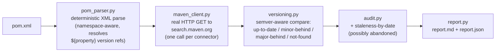

# mule-connector-audit

A CLI that parses a Mule 4 project's `pom.xml`, identifies its MuleSoft
connector dependencies, and queries the **real, live Maven Central Search
API** to find each connector's actual latest published version and release
date -- then flags connectors that are stale (multiple major/minor versions
behind, or not updated in a long time) so a team can catch outdated or
unsupported connectors before they become a security or support problem.

## No Anthropic API key required for the core feature

The entire audit pipeline -- parse `pom.xml` -> query Maven Central -> compare
versions -> flag stale ones -> render a report -- is pure deterministic
Python plus one real HTTP call per connector to a public API
(`search.maven.org`). **No LLM, no API key, and (deliberately) not even a
third-party HTTP library are involved anywhere in this path** -- `pip
install -e .` with zero dependencies is enough to run `mule-connector-audit
scan`. That's the whole point: this is a fact-checking tool, not a
guessing tool. An optional `--explain` flag (see below) can turn the
findings into a short LLM-written summary, but it is never required.

```
mule-connector-audit scan path/to/pom.xml --out report.md [--major-behind-only] [--timeout 10]
```

## How it works



Steps A-E never touch an LLM and are fully covered by an offline unit test
suite that stubs the Maven Central client (`tests/fake_maven_client.py`) --
no network access needed to run `pytest`.

## Live verification (honest disclosure)

This is the important part. Every claim below was actually executed in
this development environment, against the real `search.maven.org` API,
not fabricated or assumed.

**Outbound network access was confirmed working** -- `curl` and this
tool's own HTTP client both successfully reached `search.maven.org` over
HTTPS multiple times during development.

**API shape verification.** Before writing `maven_client.py`, the real
endpoint was queried directly with `curl` to confirm the actual JSON
shape:

```
$ curl -s "https://search.maven.org/solrsearch/select?q=g:%22org.mule.connectors%22+AND+a:%22mule-http-connector%22&core=gav&rows=20&wt=json"
{"responseHeader":{"status":0,...},"response":{"numFound":2,"start":0,"docs":[
  {"id":"org.mule.connectors:mule-http-connector:0.9.0","g":"org.mule.connectors","a":"mule-http-connector","v":"0.9.0","p":"mule-extension","timestamp":1506613359000, ...},
  {"id":"org.mule.connectors:mule-http-connector:0.8.0-BETA.4","g":"org.mule.connectors","a":"mule-http-connector","v":"0.8.0-BETA.4","p":"mule-extension","timestamp":1500336445000, ...}
]}}
```

This confirmed `core=gav` returns one document per published version with
real `v` (version) and `timestamp` (epoch ms) fields, exactly as this
project's spec assumed -- `maven_client.py`'s `get_latest_version()` uses
this shape for real, picking the highest version via its own comparator
(`versioning.py`) rather than trusting a convenience field.

**An unexpected, genuinely important real finding.** While researching
real historical version numbers for the bundled example `pom.xml`, it
became clear that **Maven Central's public index for `org.mule.connectors`
is almost entirely frozen at very old, pre-GA versions from 2017**. A
broad live query for the whole group confirms this directly:

```
$ curl -s "https://search.maven.org/solrsearch/select?q=g:%22org.mule.connectors%22&rows=100&wt=json"
```
returned exactly 10 artifacts, **every single one** with `latestVersion`
`0.9.0` and a `timestamp` of `2017-09-28`: `mule-vm-connector`,
`mule-wsc-connector`, `mule-objectstore-connector`, `mule-http-connector`,
`mule-jms-connector`, `mule-ftp-connector`, `mule-file-connector`,
`mule-email-connector`, `mule-sockets-connector`, `mule-db-connector`.
None of the actively-released, current versions of these connectors (e.g.
HTTP Connector is at major version 1.x+ today) are published to Maven
Central at all -- MuleSoft ships current connector releases through its
own Nexus repository / Anypoint Exchange instead, not proper Maven
Central. A live query for `com.mulesoft.connectors` (the certified/premium
connector group, e.g. Salesforce) returned **zero results, `numFound: 0`**
-- that group isn't indexed on Maven Central at all. Both of these were
discovered live, not assumed -- see "Limitations" below for what this
means for the tool's real-world usefulness.

**The bundled example, run for real.** `examples/pom.xml` pins four real
`org.mule.connectors` coordinates to their real, genuinely-old published
versions (`0.8.0-BETA.4`, three years' worth of "latest" being `0.9.0`),
plus one `com.mulesoft.connectors:mule-salesforce-connector` entry to
exercise the not-found path, plus one non-connector dependency to confirm
correct filtering. `examples/report.md` and `examples/report.json` are the
**actual, unedited, checked-in output** of:

```
$ mule-connector-audit scan examples/pom.xml --out examples/report.md --json-out examples/report.json --print
Scanned 6 dependencies, 5 MuleSoft connector(s) found.
Wrote examples/report.md
Wrote examples/report.json

# Mule Connector Audit -- examples/pom.xml
...
## Summary

- Up to date: **1**
- Minor/patch behind: **3**
- MAJOR version behind: **0**
- Not found on Maven Central: **1**
- No pinned version: **0**
- Possibly abandoned (no release in 2+ years): **4**

## Connectors

| Connector | Pinned | Latest (Maven Central) | Status | Last release | Abandoned? |
|---|---|---|---|---|---|
| `org.mule.connectors:mule-http-connector` | `0.8.0-BETA.4` | `0.9.0` | WARN: Minor/patch behind | 2017-09-28 | yes |
| `org.mule.connectors:mule-db-connector` | `0.8.0-BETA.4` | `0.9.0` | WARN: Minor/patch behind | 2017-09-28 | yes |
| `org.mule.connectors:mule-sockets-connector` | `0.9.0` | `0.9.0` | OK: Up to date | 2017-09-28 | yes |
| `org.mule.connectors:mule-objectstore-connector` | `0.8.0-BETA.4` | `0.9.0` | WARN: Minor/patch behind | 2017-09-28 | yes |
| `com.mulesoft.connectors:mule-salesforce-connector` | `10.5.0` | `_(none)_` | N/A: Not found on Maven Central | n/a | n/a |
```

Every number in that table came back from the real, live API in this run:
`mule-http-connector`, `mule-db-connector`, and `mule-objectstore-connector`
(pinned at the real old `0.8.0-BETA.4`) were correctly compared against the
real live latest (`0.9.0`) and flagged `minor-behind`; `mule-sockets-connector`
(pinned exactly at `0.9.0`) was correctly reported `up-to-date` on version
*and independently* flagged `possibly abandoned` (its "latest" release is
still from 2017 -- version-freshness and date-freshness are genuinely
orthogonal, and the tool checks both); `mule-salesforce-connector` was
correctly reported "not found on Maven Central" instead of crashing or
guessing. A genuine DNS failure was also forced (pointing the client at a
`.invalid` hostname) to confirm the network-failure path returns a clean
`MavenNetworkError` message rather than a raw traceback:

```
Could not reach Maven Central Search API (search.maven.org): [Errno 8] nodename nor servname provided, or not known. Check your network connection / DNS / proxy settings.
```

**Distinct from all of the above: `--explain` is optional and, in this
environment, ran as a disclosed dry run.** This environment has no
`ANTHROPIC_API_KEY` set, so `--explain` automatically fell back to
`explain.dry_run_explain()` -- a scripted summary built directly from the
same structured findings shown above, with **zero** API calls made. Real
captured output:

```
$ mule-connector-audit scan examples/pom.xml --out /tmp/r.md --explain
...
--explain set: no ANTHROPIC_API_KEY found, falling back to a disclosed scripted dry run (no API call made).
[DRY RUN: scripted from audit findings, not from Claude]
5 connector(s) audited: 1 up to date, 3 minor/patch behind, 0 a major version behind, 1 not indexed on Maven Central.
No newer release in 2+ years on Maven Central: org.mule.connectors:mule-http-connector, org.mule.connectors:mule-db-connector, org.mule.connectors:mule-sockets-connector, org.mule.connectors:mule-objectstore-connector.
Not indexed on Maven Central (verify manually via Anypoint Exchange): com.mulesoft.connectors:mule-salesforce-connector.
```

When `ANTHROPIC_API_KEY` *is* set, the exact same `--explain` flag instead
calls `client.messages.create(...)` with the same structured findings and
prints Claude's real response -- see `explain.py`'s `live_explain()`.

## Quickstart

```bash
git clone <this-repo> mule-connector-audit
cd mule-connector-audit
python3 -m venv .venv && source .venv/bin/activate
pip install -e ".[dev]"        # zero runtime deps for the core `scan` command
pytest tests/ -v                # 51 offline tests, no network required

mule-connector-audit scan examples/pom.xml --out report.md --json-out report.json --print
```

### Optional: LLM-powered `--explain`

```bash
pip install -e ".[explain]"       # pulls in the anthropic SDK
export ANTHROPIC_API_KEY=sk-ant-...
mule-connector-audit scan path/to/pom.xml --out report.md --explain
```

## CLI reference

```
mule-connector-audit scan POM_PATH
    --out PATH              Markdown report path (default: report.md)
    --json-out PATH         Optional machine-readable JSON report
    --major-behind-only     Only list connectors a full major version behind
    --timeout SECONDS       Per-lookup HTTP timeout (default: 10)
    --abandoned-days N      Staleness-by-date threshold (default: 730, ~2 years)
    --print                 Also print the Markdown report to stdout
    --explain                Optional LLM summary (falls back to a disclosed
                              scripted dry run with no API key; never required)
    --explain-model MODEL    Model for --explain (default: claude-opus-5)
```

Exit codes: `0` success, `1` the pom.xml couldn't be found/parsed, `2` a
real network failure talking to Maven Central (timeout, DNS failure,
non-2xx response, rate limiting), `3` `--explain` itself failed (e.g. a
bad API key) after the core scan already succeeded and was written to
disk.

## Project layout

```
mule_connector_audit/
  pom_parser.py     namespace-aware pom.xml parsing, ${property} version resolution
  maven_client.py   real HTTP GET to search.maven.org (urllib only, zero deps)
  versioning.py     Maven-style version parsing + up-to-date/minor/major classification
  audit.py          ties parsing + lookup + comparison + staleness-by-date together
  report.py         renders report.md and report.json
  explain.py        optional, off-by-default LLM summary (falls back to a disclosed dry run)
  cli.py            `mule-connector-audit scan ...`
examples/
  pom.xml           real MuleSoft connector coordinates, pinned to real old versions
  report.md         the actual, unedited output of a real live run (checked in)
  report.json       same run, machine-readable
tests/
  fake_maven_client.py   offline stand-in for MavenCentralClient
  test_pom_parser.py     parsing + property resolution + malformed-XML handling
  test_versioning.py     semver-ish comparison, incl. pre-release/qualifier edge cases
  test_audit.py          staleness-by-date logic, unpinned versions, not-found handling
  test_maven_client.py   network-failure handling (timeout/DNS/HTTP errors), offline
  test_report.py         Markdown/JSON rendering
  test_cli.py            end-to-end CLI behavior, exit codes, --explain dry run
```

## Limitations (honest)

- **Maven Central is a surprisingly poor source of truth for current
  MuleSoft connector versions**, discovered live during this project's own
  development (see "Live verification" above): the entire
  `org.mule.connectors` group appears frozen at 2017-era pre-GA versions
  (`0.9.0` or older) for every artifact checked, and the
  `com.mulesoft.connectors` group (certified/premium connectors, e.g.
  Salesforce, Workday, SAP) isn't indexed there **at all**. In practice,
  many real, actively-maintained Mule 4 projects pin connector versions
  (e.g. HTTP Connector `1.7.x`+) that are simply invisible to this tool's
  data source -- for those, expect either a "not found" result or a
  misleadingly-old "latest," not a false sense of security. This tool
  audits exactly what it claims to (deterministic parsing + a real query
  against the real public Maven Central API) but that data source's
  coverage of MuleSoft's own connector ecosystem is real and disclosed
  here, not a flaw hidden in the code.
- **No real MuleSoft/Anypoint Exchange Maven repository integration.**
  Querying `repository.mulesoft.org` or Anypoint Exchange's own Maven feed
  (where current connector versions actually live) was out of scope for
  this version -- doing so would require MuleSoft org credentials this
  environment doesn't have, and was not attempted or assumed to work.
- **Version comparison is Maven-flavored, not strict SemVer, and not a
  full re-implementation of Maven's `ComparableVersion`.** It parses a
  leading dotted-numeric run (padded/truncated to major.minor.patch) plus
  a qualifier suffix, and ranks common qualifier families
  (SNAPSHOT/alpha/beta/milestone/RC, in that order) below a final release.
  An unrecognized qualifier family is treated as "some kind of
  pre-release" rather than compared lexically -- a genuinely unusual
  versioning scheme could be classified incorrectly.
- **Only direct `<dependencies>` are scanned**, not
  `<dependencyManagement>`, parent POMs, or BOM imports -- a connector
  version inherited from a parent/BOM without a direct `<dependency>`
  entry in the scanned file won't be picked up.
- **`${property}` resolution is one level of indirection** against the
  same pom.xml's own `<properties>` block (plus `${project.version}`) --
  it does not resolve properties inherited from a parent pom.xml, profile-
  activated properties, or `${env.*}`/system properties.
- **Rate limiting.** `search.maven.org` is a shared public service; a
  large pom.xml audited very frequently could hit its rate limits (this
  tool surfaces an HTTP 429 as a clean `MavenNetworkError`, not a crash,
  but does not currently implement backoff/retry).
- **`--explain` is a convenience layer only**, exactly as the "Live
  verification" section discloses -- it summarizes findings that were
  already fully computed and written to disk by the deterministic core;
  it never changes the audit's classifications, and its dry-run fallback
  is clearly labeled so it's never mistaken for a real model response.

## License

MIT -- see [LICENSE](LICENSE).
