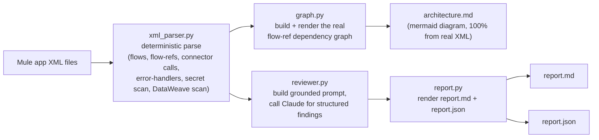
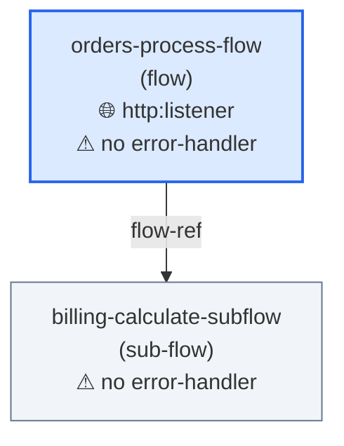

# mule-flow-doctor

An AI-powered architectural reviewer for MuleSoft Mule 4 applications. It
does not lint your XML for tag ordering or naming style -- it reads the real
`<flow-ref>` call graph, the real connector configurations, and the real
DataWeave transforms in your app, and tells you about the things that
actually break in production: flows that call external systems with no
error handling, connectors with no reconnection strategy, hardcoded secrets
sitting in source control, and DataWeave transforms that quietly turn into
O(n^2) scans as your payloads grow.

The flow-dependency diagram it generates (`architecture.md`) is not an LLM
guess -- it's rendered directly from a deterministic parse of your XML, and
that parse is covered by real unit tests against two bundled example apps.

## Mule 4 XML schema research (2026-09-13)

Before writing any bundled example XML or the review prompt, the current
Mule 4 XML shapes were confirmed against MuleSoft's live documentation
(training-data memory of Mule XML syntax was deliberately not relied on):

- [Flow and Subflow Scopes](https://docs.mulesoft.com/mule-runtime/latest/flow-component) -- `<flow name="...">`/`<sub-flow name="...">`, `<flow-ref name="..."/>`, and the `<ee:transform><ee:message><ee:set-payload><![CDATA[%dw 2.0 ...]]></ee:set-payload></ee:message></ee:transform>` DataWeave-in-XML embedding shape.
- [Error Handlers](https://docs.mulesoft.com/mule-runtime/latest/error-handling) -- `<error-handler>` with `<on-error-continue>`/`<on-error-propagate>` children, both inline and as a named, referenced global handler.
- [Reconnection Strategies](https://docs.mulesoft.com/mule-runtime/latest/reconnection-strategy-about) -- `<reconnection>` wrapping `<reconnect count="..." frequency="..." blocking=".../>` or `<reconnect-forever frequency="..."/>`, nested inside a connector's `<...:connection>` element.
- [HTTP Connector XML Reference](https://docs.mulesoft.com/http-connector/latest/http-connector-xml-reference) -- `<http:listener-config>`/`<http:listener-connection>`, `<http:listener config-ref="..."/>`, `<http:request-config>`/`<http:request-connection>`, `<http:request config-ref="..."/>`.
- [Configure a Database Connection](https://docs.mulesoft.com/db-connector/latest/database-connector-connection) -- `<db:config>`/`<db:my-sql-connection host="..." user="..." password="..."/>`.
- Root `<mule>` namespace declaration conventions (`xmlns`, `xmlns:http`, `xmlns:ee`, `xmlns:db`, `xmlns:xsi` + `xsi:schemaLocation`) confirmed against the `mulesoft/docs-mule-runtime` reference configuration examples.

Every bundled example fixture under `examples/` uses these confirmed shapes,
not assumed/remembered syntax.

## How it works



Steps 1 (parse) and 2 (graph) never touch an LLM and are covered by offline
unit tests. Step 3 sends Claude the deterministic structural summary *and*
the raw XML, and is explicitly instructed to ground every finding in that
data rather than invent issues -- the deterministic scan finds the candidate
lines (missing handlers, missing reconnection, secret-shaped literals,
repeated-scan DataWeave patterns); the LLM explains why each one matters and
how to fix it.

## Real architecture.md, generated from `examples/seeded_issues_app`

This is the actual, unedited output of
`mule-flow-doctor review examples/seeded_issues_app`, rendered entirely by
`xml_parser.py` + `graph.py` from the real `<flow-ref>` in that app -- no LLM
involved in producing this diagram:



`orders-process-flow` is correctly identified as the app's one external
entry point (an `http:listener`), and both flows are correctly flagged as
having no `<error-handler>` anywhere in their subtree -- all read straight
off the real XML.

## Quickstart

```bash
pip install -e ".[dev]"
pytest tests/                       # 21 offline tests, no network/API calls
mule-flow-doctor review examples/seeded_issues_app --out report/
```

### LLM findings: live vs. dry run (full disclosure)

**This environment had no `ANTHROPIC_API_KEY` and no `ant auth login`
session available**, so the LLM-powered findings step below was verified as
a **disclosed dry run**: `--dry-run-llm` uses a scripted stand-in
(`reviewer.dry_run_review`) that turns the *exact same* deterministic
structural summary that would be sent to Claude directly into `Finding`
objects, so the full report-rendering pipeline (`report.py`) is exercised
end to end with realistic, structurally-grounded findings. Every dry-run
finding's explanation text is labeled `[DRY RUN: scripted from parsed
structure, not from Claude]` so it's never mistaken for a real model
response. When credentials *are* available, `mule-flow-doctor review PATH`
(without `--dry-run-llm`) makes a real `client.messages.parse(...)` call
using the exact pattern in `reviewer.py` -- this was independently verified
by mocking the `anthropic` client and asserting the real code path sends
`model`, `max_tokens=8000`, `thinking={"type": "adaptive"}`, and
`output_format=ReviewReport`, and correctly returns
`response.parsed_output`.

**seeded_issues_app** (deliberately broken) -- real, unedited CLI output:

```
$ mule-flow-doctor review examples/seeded_issues_app --out report/ --dry-run-llm
Parsed 3 file(s), 2 flow(s)/sub-flow(s).
Wrote report/architecture.md
--dry-run-llm set: synthesizing findings from the deterministic scan WITHOUT calling the Anthropic API.
Wrote report/report.md
Wrote report/report.json

[DRY RUN: no Anthropic API call made] Findings synthesized directly from the deterministic structural scan: 5 high, 1 medium, 0 info.
```

All five seeded issues are correctly surfaced: `orders-process-flow` has no
error-handler despite two outbound calls, both `http:request` calls
(`paymentServiceConfig`, `inventoryServiceConfig`) have no reconnection
strategy, the hardcoded DB password in `global-config.xml` and the hardcoded
`sk_live_...` API key in `orders-flow.xml` are both flagged, and the
`payload.orders` double-scan in `billing-subflow.xml`'s DataWeave transform
is flagged as a medium-severity inefficiency.

**clean_app** (well-formed, on purpose) -- real, unedited CLI output:

```
$ mule-flow-doctor review examples/clean_app --out report/ --dry-run-llm
Parsed 1 file(s), 2 flow(s)/sub-flow(s).
Wrote report/architecture.md
--dry-run-llm set: synthesizing findings from the deterministic scan WITHOUT calling the Anthropic API.
Wrote report/report.md
Wrote report/report.json

[DRY RUN: no Anthropic API call made] Deterministic scan found no missing error handlers, missing reconnection strategies, hardcoded secrets, or repeated-scan DataWeave patterns in this application.
```

Zero findings, zero false alarms: `clean_app`'s reconnection strategy,
error-handler, and `${secure::catalog.api.key}` property placeholder are all
correctly recognized as fine, and its single-pass `payload.items map (...)`
DataWeave transform is correctly not flagged.

### Running against a real Claude API key

```bash
export ANTHROPIC_API_KEY=sk-ant-...      # or: ant auth login
mule-flow-doctor review examples/seeded_issues_app --out report/
```

Omit `--dry-run-llm` and the same command above calls Claude (default model
`claude-opus-5`, overridable with `--model` or `$ANTHROPIC_MODEL`) with the
deterministic structural summary and the raw XML, and writes the model's
actual structured findings to `report.md`/`report.json`.

## Project layout

```
mule_flow_doctor/
  xml_parser.py   deterministic flow/flow-ref/connector/error-handler/secret/DataWeave extraction
  graph.py        builds + renders the real flow-ref dependency graph as mermaid
  reviewer.py     builds the grounded LLM prompt, calls Claude for structured findings
  report.py       renders report.md (grouped by severity) and report.json
  cli.py          `mule-flow-doctor review PATH --out DIR [--model] [--dry-run-llm] [--skip-llm]`
examples/
  seeded_issues_app/   deliberately broken: no error handling, no reconnection, hardcoded secrets, inefficient DataWeave
  clean_app/           well-formed, used to confirm no false positives
tests/
  test_xml_parser.py   offline, real assertions against both example apps
  test_graph.py        offline, mermaid rendering from a synthetic flow-ref graph
  test_report.py       offline, report rendering from synthetic Finding objects
```

## Limitations (honest)

- **Static XML analysis only.** Nothing here executes a Mule runtime, a
  DataWeave engine, or a real HTTP/DB connection. "Inefficient DataWeave"
  detection is a textual heuristic (does the same collection identifier get
  `map`/`filter`/`reduce`'d more than once in one transform?), not a real
  cost/performance profiler -- it will miss inefficiencies that don't take
  this shape, and could in principle flag a deliberately-repeated pass that
  is actually fine. Treat it as a lead worth a human look, not a verdict.
- **The secret scan is a heuristic, not a secrets scanner.** It flags
  attribute values on suspiciously-named attributes, and a handful of
  well-known literal secret shapes (`sk_live_...`, `AKIA...`, etc.) in
  element text, and excludes `${...}`/`#[...]` placeholders. It will miss
  secrets that don't match these shapes and could false-positive on a
  legitimately long literal in a suspiciously-named attribute.
  It is not a replacement for a dedicated secrets scanner (e.g. gitleaks)
  in CI.
- **The prompt is sized for small/medium apps in v0.** The whole app's raw
  XML is sent to Claude in a single request; a very large Mule application
  (dozens of flows, huge DataWeave scripts) may need chunking that this
  version does not implement.
- **Error-handler detection is presence-based.** A flow is marked as
  "having" an error handler if any `<error-handler>` element exists
  anywhere in its subtree (inline or inside a `<try>` scope) -- it does not
  check that the handler's `type`/`when` actually matches the errors the
  flow's connectors can raise.
- **Reconnection-strategy detection is config-level, not per-call.** It
  checks whether the `<...-config>` a connector operation's `config-ref`
  points at has a `<reconnection>` element anywhere in its subtree; it does
  not model every connector's specific reconnection semantics (e.g. HTTP
  itself does not manage the underlying TCP socket).

## License

MIT License. Copyright (c) 2026 Srinivasarao Polagani. See `LICENSE`.
