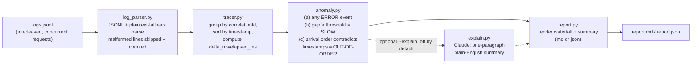

# mule-log-tracer

A CLI that turns a wall of scattered, interleaved Mule/CloudHub application
log lines into a readable, ordered per-request "waterfall" trace. Production
Mule logs interleave dozens of concurrent requests in the order they happen
to be written, not the order any one request executed in -- this tool groups
every log line belonging to the same request by its correlation ID, sorts
them back into chronological order, computes per-step time deltas, and
flags real anomalies (a slow step, an ERROR-level event, an out-of-order
timestamp) so a debugging session starts with "here's what happened to
request X," not a `grep` and a headache.

This is a companion project to two other already-built tools by the same
author, [`mule-flow-doctor`](../mule-flow-doctor) (deterministic Mule XML
architecture review) and [`dataweave-copilot`](../dataweave-copilot)
(DataWeave generation/explanation) -- see their READMEs for the same
honesty-disclosure conventions followed here.

## Why this matters for production debugging

When an incident report says "request `abc-123` failed around 9:03am," the
raw CloudHub log for that minute has that request's lines mixed in with
every other concurrent request's lines. Reconstructing what actually
happened -- which flow ran, which connector call took too long, where the
error was raised -- by eye is slow and error-prone. `mule-log-tracer` does
that reconstruction mechanically and deterministically, every time, for
every request in the file, in about the time it takes to read the file.

## Core requirement met: no API key needed for the core function

**Parsing, correlation-ID grouping, timeline reconstruction, and anomaly
detection are 100% deterministic Python -- no LLM, no network call, no
API key required.** `log_parser.py`, `tracer.py`, `anomaly.py`, and
`report.py` are plain code covered by offline unit tests; you can run
`mule-log-tracer trace` all day with no credentials configured. This is a
deliberate design choice, not a limitation of a first version: correlating
log lines by an ID and diffing timestamps is a solved, mechanical problem,
and using an LLM for it would make the tool slower, non-deterministic, and
dependent on a paid API for something that doesn't need one.

The **one** genuinely optional exception is `--explain`, covered below.

## The expected input shape

There is no single universal log schema across CloudHub, self-managed Mule
runtimes, and third-party log shippers (DataDog, Splunk, ELK, etc.) --
every deployment ships logs slightly differently. This tool documents one
realistic, reasonable synthetic shape modeled on how Mule logging actually
works (`%correlationId%` / MDC-pattern logging, JSON-per-line shipping) and
supports it plus a plaintext fallback. It is not a byte-for-byte
reproduction of one specific vendor's exact schema.

### 1. JSON Lines (primary format)

One JSON object per line. Required fields:

| field           | type   | notes                                              |
|-----------------|--------|-----------------------------------------------------|
| `timestamp`     | string | ISO-8601, e.g. `2026-09-13T09:00:00.150Z`           |
| `correlationId` | string | Mule's real correlation ID mechanism (`%correlationId%` / MDC) |
| `flowName`      | string | the flow or sub-flow that emitted this line          |
| `level`         | string | `INFO` / `WARN` / `ERROR` / `DEBUG` (case-insensitive) |
| `message`       | string | the human-readable log message                       |

Optional fields:

| field           | type   | notes                                                          |
|-----------------|--------|-----------------------------------------------------------------|
| `processorPath` | string | e.g. `orders-process-flow/processors/1`, for finer-grained location |
| `event`         | string | e.g. `flow-start`, `flow-end`, `connector-call`, `error`         |

Example line:

```json
{"timestamp": "2026-09-13T09:00:00.080Z", "correlationId": "a47ac10b-58cc-4372-a567-0e02b2c3d479", "flowName": "orders-process-flow", "level": "INFO", "event": "connector-call", "message": "Calling inventory-check-flow via flow-ref", "processorPath": "orders-process-flow/processors/1"}
```

### 2. Plaintext fallback

For logs that were never shipped as JSON, a line shaped like:

```
2026-09-13T09:00:00.150Z INFO [payment-process-flow] correlationId=b58ac10b-58cc-4372-a567-0e02b2c3d480 - Calling payment-gateway-service via HTTP request
```

is parsed with a real, tested regex (`PLAINTEXT_LOG_RE` in `log_parser.py`):
`<ISO-8601 timestamp> <LEVEL> [<flowName>] correlationId=<id> - <message>`
(the trailing `- <message>` is optional).

### Malformed lines

Any line that is neither valid JSON nor a recognizable plaintext line is
**skipped and counted**, never crashes the run. `ParseStats` reports how
many lines were parsed (JSON vs. plaintext) and how many were skipped, and
the CLI prints that summary before the report.

## How it works



Steps A through E never touch an LLM and are covered by offline unit tests.
Only the dotted `--explain` path calls Claude, and only for traces that
already have a detected anomaly.

### The three anomaly rules, precisely

- **(a) Error rule.** Any event in a trace with `level == "ERROR"` flags
  the whole trace.
- **(b) Slow-step rule.** Any gap between two *chronologically consecutive*
  events in a trace exceeding `--slow-threshold-ms` (default `2000`)
  flags that step as `**SLOW**`.
- **(c) Out-of-order / clock-skew rule.** This is checked against the
  order events *actually arrived in the source file*, not the
  timestamp-sorted waterfall (sorting would trivially "fix" the order and
  hide the very signal this rule exists to surface). If a log line for a
  correlation ID arrives later in the file but carries an earlier
  timestamp than a line that arrived before it, that's flagged as a real
  out-of-order/clock-skew signal worth a human's attention.

## CLI usage

```bash
mule-log-tracer trace logs.jsonl --out report.md \
    [--correlation-id <id>] [--slow-threshold-ms 2000] \
    [--format md|json] [--explain] [--model claude-opus-5] [--mermaid]
```

- Without `--correlation-id`, every trace found in the file is reported,
  **sorted with traces containing errors first**, then traces with a slow
  step or out-of-order event, then healthy traces.
- With `--correlation-id <id>`, only that one request's trace is reported
  -- useful when you already know which request you're debugging.
- `--mermaid` additionally emits a mermaid sequence diagram per trace (bonus,
  Markdown output only).
- `--format json` emits a machine-readable report instead of Markdown.

## Real, generated example (not hand-written)

`examples/sample_cloudhub_logs.jsonl` is a synthetic-but-realistic log file
with **3 interleaved correlation IDs** simulating concurrent requests --
the lines are genuinely interleaved by timestamp across requests, the way
production logs actually look, not grouped contiguously per request. It
was built to demonstrate exactly three outcomes:

1. A healthy request (`orders-process-flow` -> `inventory-check-flow`),
   4 fast INFO steps, no anomalies.
2. A request with a genuine slow step (`payment-process-flow` waits
   ~5050ms on `payment-gateway-service`) -- flagged `SLOW`.
3. A request with a real ERROR partway through (`shipment-process-flow`'s
   call to `carrier-api-service` fails with HTTP 503) -- flagged `ERROR`.

`examples/sample_report.md` is the **real, unedited output** of actually
running the CLI against that file in this environment:

```
$ mule-log-tracer trace examples/sample_cloudhub_logs.jsonl --out examples/sample_report.md --mermaid
Parsed 12 log line(s) (12 JSON, 0 plaintext).
Wrote examples/sample_report.md
Traces: 3 total, 1 with errors, 1 with slow steps, 0 with out-of-order events.
```

That's exactly the 3 outcomes the example was designed to prove: 1 healthy,
1 slow, 1 error, 0 false positives on out-of-order (the file's timestamps
are honestly ordered) -- and `tests/test_example.py` asserts on this real
output programmatically, not just by eyeballing the Markdown.

## `--explain`: optional LLM summary (off by default, honestly disclosed)

`--explain` asks Claude (`anthropic.Anthropic()`, default model
`claude-opus-5`, overridable with `--model`/`$ANTHROPIC_MODEL`,
`thinking={"type": "adaptive"}`) for a one-paragraph plain-English summary
of what likely went wrong, for every trace that already has a detected
anomaly. It is off unless you pass the flag, and it changes nothing about
how anomalies are detected -- it only summarizes anomalies the deterministic
engine already found.

**This environment has no `ANTHROPIC_API_KEY` and no `ANTHROPIC_AUTH_TOKEN`**
(checked: both unset). So the `--explain` run below is a **disclosed dry
run**: `_get_explain_client()` in `cli.py` detects the missing credentials
and calls `explain.dry_run_explain()` instead of the real Anthropic API --
that function synthesizes an equivalent summary directly from the same
`Anomalies` object a real call would be given, and every dry-run summary is
prefixed `[DRY RUN: scripted from the deterministic anomaly data, not from
Claude]` so it's never mistaken for a real model response.

Real, captured output from this environment:

```
$ mule-log-tracer trace examples/sample_cloudhub_logs.jsonl --explain --out /tmp/explained.md
Parsed 12 log line(s) (12 JSON, 0 plaintext).
--explain set: no Anthropic API key found in this environment (ANTHROPIC_API_KEY/ANTHROPIC_AUTH_TOKEN unset, or the `anthropic` package is not installed) -- generating DISCLOSED DRY-RUN explanations synthesized from the deterministic anomaly data instead of calling Claude.
Wrote /tmp/explained.md
Traces: 3 total, 1 with errors, 1 with slow steps, 0 with out-of-order events.
```

Excerpt of the dry-run text actually produced for the error trace:

> [DRY RUN: scripted from the deterministic anomaly data, not from Claude]
> This trace shows an ERROR-level event in flow 'shipment-process-flow' at
> +580ms ('Connector operation carrier-api:create-label failed: HTTP 503
> Service Unavailable from carrier-api-service'). Recommend correlating
> with the affected flow(s)/connector(s) directly and checking the
> surrounding infrastructure (downstream service health, network latency,
> node clocks) as the next debugging step.

With a real API key set (`export ANTHROPIC_API_KEY=sk-ant-...`), the exact
same `--explain` flag makes a real `client.messages.create(...)` call using
the pattern in `explain.py` (`model`, `max_tokens=1024`,
`thinking={"type": "adaptive"}`, a grounding system prompt, and the same
per-trace anomaly data serialized into the user message) and writes the
model's real summary into the report instead.

## Quickstart

```bash
pip install -e ".[dev]"
pytest tests/ -v                     # 28 offline tests, no network/API calls
mule-log-tracer trace examples/sample_cloudhub_logs.jsonl --out report.md
```

## Project layout

```
mule_log_tracer/
  log_parser.py   JSONL + plaintext-fallback parsing into LogEvent, malformed lines skipped + counted
  tracer.py       group by correlationId, sort by timestamp, compute delta_ms/elapsed_ms
  anomaly.py      the three deterministic anomaly rules (error / slow / out-of-order)
  report.py       renders the Markdown/JSON waterfall report + summary + optional mermaid diagram
  explain.py      optional, off-by-default Claude summary of anomalous traces (dry-run fallback included)
  cli.py          `mule-log-tracer trace PATH --out ... [--correlation-id] [--slow-threshold-ms] [--format] [--explain] [--model] [--mermaid]`
examples/
  sample_cloudhub_logs.jsonl   3 interleaved correlation IDs: 1 healthy, 1 slow, 1 error
  sample_report.md             real, unedited output of running the CLI against the file above
tests/
  test_log_parser.py   JSONL + plaintext parsing, malformed-line handling
  test_tracer.py       correlation-ID grouping, chronological sort, delta/elapsed computation, arrival-order preservation
  test_anomaly.py      each of the 3 anomaly rules with a trigger case AND a control case that must NOT trigger it
  test_report.py       Markdown/JSON report rendering
  test_example.py      runs the real pipeline against the bundled example and asserts the exact 1 healthy / 1 slow / 1 error outcome
```

## Limitations (honest)

- **The log schema is documented, not universal.** There is no single
  standard JSON shape across CloudHub, self-managed Mule, and third-party
  log shippers. The JSONL shape here is a reasonable, clearly-documented
  synthetic format modeled on real Mule logging conventions -- a real
  deployment's actual log shape may need small field-name adjustments to
  `log_parser.py` before this tool works against it unmodified.
- **Clock-skew detection is a signal, not a diagnosis.** Rule (c) flags
  when a log line arrives out of order relative to its own timestamp; it
  cannot tell you *why* (NTP drift, multi-node request handling, log
  shipper buffering/retries all produce this same signal) -- treat it as a
  lead worth investigating, not a root cause.
- **No support for distributed tracing headers.** This tool correlates
  purely on Mule's `correlationId` field; it does not parse or stitch
  together W3C `traceparent`/`tracestate` headers or other distributed
  tracing propagation formats. A request that crosses into a
  non-Mule/non-correlationId-aware system will show up as a dead end in
  the trace, not a continued span.
- **The plaintext fallback regex expects one specific line shape.** Real
  plaintext log formats vary a lot; `PLAINTEXT_LOG_RE` matches the
  documented `<timestamp> <LEVEL> [<flow>] correlationId=<id> - <message>`
  shape and its "no trailing message" variant, not arbitrary plaintext
  layouts.
- **The slow-step threshold is a single global number.** A 2000ms gap
  might be perfectly normal for a batch flow and alarming for a
  low-latency API -- `--slow-threshold-ms` is a blunt, per-run instrument,
  not a per-flow SLA model.
- **This session had no live Anthropic credentials.** The `--explain`
  output above was captured with the real Anthropic call replaced by the
  disclosed dry-run fallback, as described above. It has not been
  re-verified against a live model response.

## License

MIT License. Copyright (c) 2026 Srinivasarao Polagani. See `LICENSE`.
