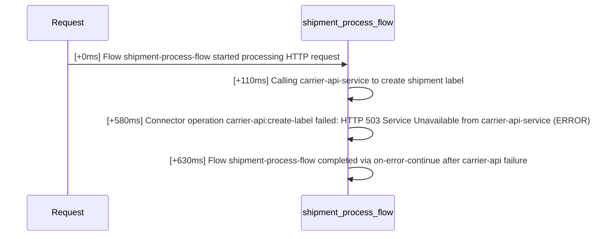
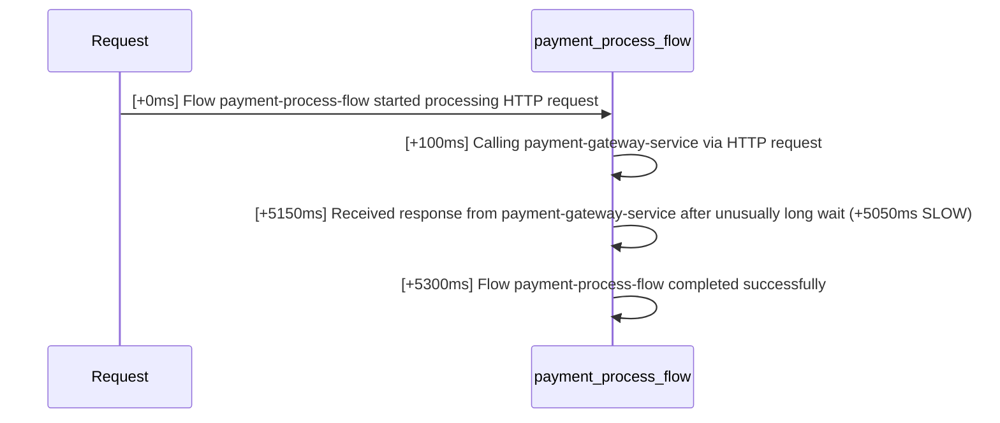
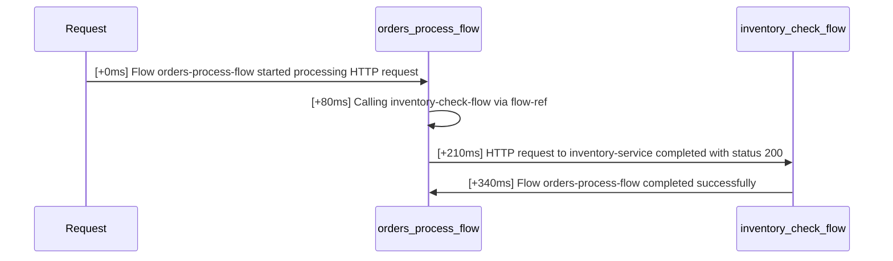

# mule-log-tracer report

## Summary

- Total traces: 3
- Traces with errors: 1
- Traces with slow steps: 1
- Traces with out-of-order/clock-skew events: 0
- Healthy traces: 1
- Log lines parsed: 12 (JSON: 12, plaintext: 0)
- Log lines skipped (malformed): 0

---

## Trace `c69ac10b-58cc-4372-a567-0e02b2c3d481` -- ⚠ ERROR

- Steps: 4
- Start: 2026-09-13T09:00:00.020000+00:00
- End: 2026-09-13T09:00:00.650000+00:00
- Total duration: 630ms

| # | elapsed | delta | level | flow | message |
|---|---------|-------|-------|------|---------|
| 1 | 0ms | +0ms | INFO | shipment-process-flow | Flow shipment-process-flow started processing HTTP request |
| 2 | 110ms | +110ms | INFO | shipment-process-flow | Calling carrier-api-service to create shipment label |
| 3 | 580ms | +470ms | **ERROR** | shipment-process-flow | ⚠ Connector operation carrier-api:create-label failed: HTTP 503 Service Unavailable from carrier-api-service **ERROR** |
| 4 | 630ms | +50ms | WARN | shipment-process-flow | Flow shipment-process-flow completed via on-error-continue after carrier-api failure |

### Sequence diagram

---

## Trace `b58ac10b-58cc-4372-a567-0e02b2c3d480` -- ⚠ SLOW STEP

- Steps: 4
- Start: 2026-09-13T09:00:00.050000+00:00
- End: 2026-09-13T09:00:05.350000+00:00
- Total duration: 5300ms

| # | elapsed | delta | level | flow | message |
|---|---------|-------|-------|------|---------|
| 1 | 0ms | +0ms | INFO | payment-process-flow | Flow payment-process-flow started processing HTTP request |
| 2 | 100ms | +100ms | INFO | payment-process-flow | Calling payment-gateway-service via HTTP request |
| 3 | 5150ms | +5050ms | INFO | payment-process-flow | ⚠ Received response from payment-gateway-service after unusually long wait **SLOW** (+5050ms) |
| 4 | 5300ms | +150ms | INFO | payment-process-flow | Flow payment-process-flow completed successfully |

### Sequence diagram

---

## Trace `a47ac10b-58cc-4372-a567-0e02b2c3d479` -- healthy

- Steps: 4
- Start: 2026-09-13T09:00:00+00:00
- End: 2026-09-13T09:00:00.340000+00:00
- Total duration: 340ms

| # | elapsed | delta | level | flow | message |
|---|---------|-------|-------|------|---------|
| 1 | 0ms | +0ms | INFO | orders-process-flow | Flow orders-process-flow started processing HTTP request |
| 2 | 80ms | +80ms | INFO | orders-process-flow | Calling inventory-check-flow via flow-ref |
| 3 | 210ms | +130ms | INFO | inventory-check-flow | HTTP request to inventory-service completed with status 200 |
| 4 | 340ms | +130ms | INFO | orders-process-flow | Flow orders-process-flow completed successfully |

### Sequence diagram

---
