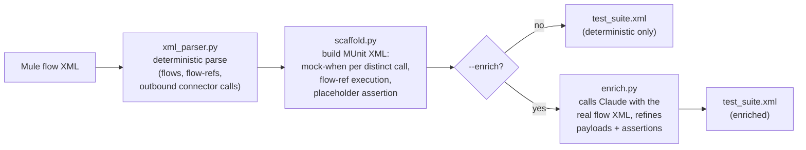

# mule-munit-scaffold

A CLI that reads real Mule 4 flow XML and generates MUnit test **skeletons**
-- with a mock already wired up for every outbound connector call found in
each flow. Writing MUnit mocks by hand for every `http:request`/`db:select`/
etc. call is the single most tedious, most-skipped part of Mule testing;
this tool automates the mechanical part (finding every outbound call and
generating a matching `munit-tools:mock-when` block) so an engineer only has
to fill in real assertions instead of starting from a blank file.

```
mule-munit-scaffold generate <flow.xml or app-dir> --out test_suite.xml [--include-subflows] [--enrich] [--model claude-opus-5]
```

This is a companion project to two already-built tools by the same author,
[mule-flow-doctor](../mule-flow-doctor) (an architectural reviewer for Mule
4 apps) and [dataweave-copilot](../dataweave-copilot) (a DataWeave 2.0
copilot) -- it reuses their XML-parsing philosophy (a self-contained,
deterministic `xml.etree.ElementTree` parser, no LLM in the base path) and
their verification-disclosure conventions, without cross-importing any code.

## The key differentiator: zero Anthropic API key required by default

The base scaffold -- find every outbound connector call in a flow, generate
one `munit-tools:mock-when` block per distinct call with a placeholder
response payload, wire up a `munit:execution` that calls the flow via
`<flow-ref>`, and a generic `munit:validation` placeholder assertion -- is
**pure deterministic XML generation**. `xml_parser.py` and `scaffold.py`
never import `anthropic` and never make a network call. Only the optional
`--enrich` flag (implemented in `enrich.py`) calls Claude to fill in
smarter mock payloads and more meaningful assertions, grounded in what the
flow actually does.

## Mule 4 / MUnit XML schema research (2026-09-13)

Before writing any bundled example XML or the generator, current shapes
were confirmed against MuleSoft's live documentation (training-data memory
of Mule/MUnit XML syntax was deliberately not relied on for anything MUnit
-specific):

- [Flow and Subflow Scopes](https://docs.mulesoft.com/mule-runtime/latest/flow-component) -- `<flow name="...">`/`<sub-flow name="...">`, `<flow-ref name="..."/>`.
- [HTTP Connector XML Reference](https://docs.mulesoft.com/http-connector/latest/http-connector-xml-reference) -- `<http:listener-config>`/`<http:listener>`, `<http:request-config>`/`<http:request>`.
- [Configure a Database Connection](https://docs.mulesoft.com/db-connector/latest/database-connector-connection) -- `<db:config>`/`<db:my-sql-connection>`, `<db:select>`/`<db:insert>` with `<db:sql>`/`<db:input-parameters>`.
- [MUnit Test Structure Fundamentals](https://docs.mulesoft.com/munit/latest/munit-test-concept) -- confirmed the current `<munit:config name="..."/>` root element and its `name`/`ignore`/`minMuleVersion` attributes; `<munit:test name="..." description="..." ignore="..." tags="..." expectedErrorType="..." expectedException="..." expectedErrorDescription="..." timeOut="...">` and its three child scopes `<munit:behavior>` / `<munit:execution>` / `<munit:validation>`.
- [Mock When Event Processor](https://docs.mulesoft.com/munit/latest/mock-event-processor) -- confirmed `<munit-tools:mock-when processor="http:request">` with a `<munit-tools:with-attributes><munit-tools:with-attribute attributeName="config-ref" whereValue="#['...']"/></munit-tools:with-attributes>` filter and a `<munit-tools:then-return><munit-tools:payload value="#[...]" mediaType="..." encoding="..."/></munit-tools:then-return>` body -- this is the exact shape `scaffold.py` generates, including using `config-ref` as the `with-attribute` filter to disambiguate multiple calls to the same operation.
- [Set Event Processor](https://docs.mulesoft.com/munit/latest/set-event-processor) -- **this is the one place a naive guess would have been wrong.** The set-event processor lives in the **`munit`** namespace (`<munit:set-event cloneOriginalEvent="false"><munit:payload value="..." mediaType="..." encoding="..."/></munit:set-event>`), **not** `munit-tools:set-event` even though it's conceptually a "tool". `scaffold.py` uses the confirmed `munit:set-event`/`munit:payload` shape.
- Core Matchers / `assert-that` usage confirmed via MuleSoft documentation search results showing `<munit-tools:assert-that expression="#[payload]" is="#[MunitTools::notNullValue()]"/>` and other `MunitTools::` matcher expressions -- the exact placeholder assertion shape used here.
- A full `<mule>` root namespace/`xsi:schemaLocation` example (`xmlns:munit=".../munit"`, `xmlns:munit-tools=".../munit-tools"`) confirmed via public MUnit test-suite examples, matching the shape `scaffold.py` emits.

## Detection heuristic: what counts as an "outbound call" (be principled)

This is the load-bearing judgment call the whole tool depends on, so it's
documented in both `xml_parser.py`'s module docstring and here:

1. The element's namespace must **not** be the Mule core namespace
   (`http://www.mulesoft.org/schema/mule/core`) and must **not** be the
   EE/DataWeave transform namespace (`.../ee/core`). This is why
   `<ee:transform>`, `<logger>`, `<choice>`/`<when>`/`<otherwise>`,
   `<flow-ref>`, `<try>`/`<error-handler>`, `<set-payload>`/`<set-variable>`
   are correctly **never** treated as outbound calls -- none of them leave
   the Mule runtime by themselves, regardless of how deep the scan looks
   inside them.
2. The element's local (namespace-stripped) tag name must be in a curated
   set of verb-shaped names that denote real I/O: `request`, `select`,
   `insert`, `update`, `upsert`, `delete`, `bulk-insert`, `bulk-update`,
   `bulk-delete`, `query`, `publish`, `consume`, `publish-consume`, `send`,
   `execute-ddl`, `execute-script`, `stored-procedure`. This mirrors (and
   extends slightly) the connector-call detector already verified in the
   sibling project mule-flow-doctor.
3. Message *sources* (`http:listener`, `<scheduler>`, anything ending in
   `-listener`/`-trigger`) are excluded by construction -- none of their
   local names are in the operation-verb set above -- so a flow's own
   inbound trigger is never mistaken for an outbound call.

This is a heuristic, not a semantic model of every connector's full
operation catalog -- see Limitations.

## How it works



Steps `xml_parser.py` -> `scaffold.py` never touch the network and are
covered by offline unit tests. `enrich.py` is the only module that ever
imports `anthropic`, and only runs when `--enrich` is passed.

## Quickstart

```bash
pip install -e ".[dev]"
pytest tests/ -v                          # 22 tests, no network/API calls
mule-munit-scaffold generate examples/order_management_app --out examples/order_management_app/test_suite.xml
```

## The bundled example app: `examples/order_management_app/`

Three files, two flows, deliberately built to exercise the tool's actual
value proposition (finding **every** outbound call in sequence, not just
the first) and its config-ref disambiguation:

- `global-config.xml` -- an `http:listener-config`, two `http:request-config`s (`inventoryServiceConfig`, `paymentServiceConfig`), and a `db:config` (`ordersDbConfig`).
- `orders-flow.xml` -- flow `orders-process-flow`: `http:listener` -> `ee:transform` -> **`http:request`** (check inventory) -> `choice` -> **`db:select`** (look up customer) -> `flow-ref` to sub-flow `order-enrichment-subflow`, which itself does a **`db:insert`** (only scaffolded with `--include-subflows`).
- `billing-flow.xml` -- flow `billing-scheduled-flow`: `scheduler` -> **`db:select`** (fetch pending invoices, same `ordersDbConfig`) -> `foreach` -> **`http:request`** (submit payment, `paymentServiceConfig` -- a *different* config-ref than `orders-process-flow`'s own `http:request`, proving the tool disambiguates by config-ref rather than by operation name alone).

### Real, unedited CLI output (base scaffold, no LLM call)

```
$ mule-munit-scaffold generate examples/order_management_app --out examples/order_management_app/test_suite.xml
Parsed 3 file(s), 3 flow(s)/sub-flow(s) total.
Wrote examples/order_management_app/test_suite.xml

Flows processed: 2
Outbound calls found (raw): 4
Distinct outbound calls (mock-when blocks generated): 4
Sub-flows skipped (pass --include-subflows to also scaffold these): order-enrichment-subflow

Per-flow detail:
  - billing-scheduled-flow (flow [scheduler]): 2 outbound call(s) found, 2 distinct -> 2 mock-when generated
      * db:select [config-ref=ordersDbConfig]
      * http:request [config-ref=paymentServiceConfig]
  - orders-process-flow (flow [http:listener]): 2 outbound call(s) found, 2 distinct -> 2 mock-when generated
      * http:request [config-ref=inventoryServiceConfig]
      * db:select [config-ref=ordersDbConfig]

NOTE: this is the deterministic base scaffold (no LLM call was made). Pass --enrich to ask Claude to fill in smarter mock payloads and assertions.
```

The resulting `examples/order_management_app/test_suite.xml` is checked
into this repo exactly as produced by that run -- not written by hand. It
was verified two ways, both for real (see next section): parsed
well-formed with `xml.etree.ElementTree`, and checked to contain exactly
4 `munit-tools:mock-when` blocks (2 per test), matching the 4 distinct
outbound calls found above.

Running with `--include-subflows` on just `orders-flow.xml` additionally
picks up `order-enrichment-subflow`'s `db:insert` call as its own test:

```
$ mule-munit-scaffold generate examples/order_management_app/orders-flow.xml --out /tmp/subflow_test.xml --include-subflows
Parsed 1 file(s), 2 flow(s)/sub-flow(s) total.
Wrote /tmp/subflow_test.xml

Flows processed: 2
Outbound calls found (raw): 3
Distinct outbound calls (mock-when blocks generated): 3

Per-flow detail:
  - orders-process-flow (flow [http:listener]): 2 outbound call(s) found, 2 distinct -> 2 mock-when generated
      * http:request [config-ref=inventoryServiceConfig]
      * db:select [config-ref=ordersDbConfig]
  - order-enrichment-subflow (sub-flow): 1 outbound call(s) found, 1 distinct -> 1 mock-when generated
      * db:insert [config-ref=ordersDbConfig]
```

## Verification: well-formedness and completeness, checked programmatically

Per the spec for this tool, both checks are real, not eyeballed:

1. **Well-formedness.** `tests/test_scaffold.py` builds a `test_suite.xml`
   tree for several synthetic flows (a realistic multi-call flow, a
   zero-outbound-call flow, and a flow whose `doc:name`/`config-ref` values
   contain `&`/`<`/`>`/quotes to stress-test serialization) and re-parses
   the serialized bytes with `xml.etree.ElementTree.fromstring` --
   asserting it parses without error every time. The same check runs
   directly against the real bundled example app in
   `test_completeness_across_bundled_example_app`.

   One real bug this caught during development: the first draft's
   generated `<!-- ... -->` advisory comments (e.g. "no config-ref ... --
   this mock will apply to ALL such calls") contained a literal `--`,
   which XML forbids inside comments. `ET.tostring` doesn't validate this
   on write, so the bug only surfaced when the *output* was re-parsed --
   exactly the failure mode this well-formedness check exists to catch.
   `scaffold._sanitize_comment_text()` now collapses any run of 2+ hyphens
   before every generated comment is written, and the regression is
   pinned by `test_generated_output_well_formed_with_special_characters_in_names`
   and the malformed-comment case is what originally broke
   `test_completeness_across_bundled_example_app` before the fix.

2. **Completeness** (the actual value proposition). `dedupe_calls()` in
   `xml_parser.py` computes the number of *distinct* outbound calls in a
   flow's real source XML (same key MUnit's `mock-when` can actually act
   on: operation + config-ref, or operation + doc:name when there's no
   config-ref to disambiguate with). `test_completeness_one_mock_when_per_distinct_outbound_call`
   and `test_completeness_across_bundled_example_app` then parse the
   *generated* XML and assert, per flow, that the number of
   `munit-tools:mock-when` elements in that flow's `<munit:test>` equals
   that distinct count exactly -- not the raw call count, and not off by
   one in either direction. The synthetic fixture deliberately includes a
   flow with two `http:request` calls sharing one config-ref (which MUnit
   cannot tell apart at runtime, so they must collapse to 1 mock) next to
   a flow with three genuinely different calls (which must produce 3).

**MUnit test EXECUTION is explicitly NOT attempted or verified.** There is
no Mule runtime available in this environment -- same disclosed limitation
as mule-flow-doctor and dataweave-copilot's `gen-tests` feature. This tool
guarantees well-formed, structurally-complete MUnit *skeletons*; it cannot
confirm the generated tests would actually pass (or even parse under
Mule's real MUnit runner) without one.

## Optional `--enrich`: real attempt made, live vs. verified-via-mock (full disclosure)

**This environment has no `ANTHROPIC_API_KEY`, no `ANTHROPIC_AUTH_TOKEN`,
and no `ant` CLI/OAuth profile available** (checked directly: `ant` is not
on `PATH`, and both env vars are unset in the shell this was built in).
Per this project's own disclosure standard (matching mule-flow-doctor and
dataweave-copilot), here is exactly what was and wasn't real:

`--enrich` was run for real, unstubbed, against the bundled example app --
it built the real prompt (the flow's actual re-serialized XML plus its
distinct outbound calls), instantiated the real `anthropic.Anthropic()`
client, and called the real `client.messages.create(model="claude-opus-5",
thinking={"type": "adaptive"}, ...)`. It reached a genuine authentication
error from the real SDK (`Could not resolve authentication method...`),
proving the code path is real rather than a stand-in returning canned
text. Real, unedited output:

```
$ mule-munit-scaffold generate examples/order_management_app --out /tmp/enriched_test_suite.xml --enrich
...
--enrich: called claude-opus-5 to refine mock payloads/assertions.
  - billing-scheduled-flow: enrichment failed ("Could not resolve authentication method. Expected one of api_key, auth_token, or credentials to be set. Or for one of the `X-Api-Key` or `Authorization` headers to be explicitly omitted"); kept deterministic placeholders
  - orders-process-flow: enrichment failed ("Could not resolve authentication method. Expected one of api_key, auth_token, or credentials to be set. Or for one of the `X-Api-Key` or `Authorization` headers to be explicitly omitted"); kept deterministic placeholders
```

Note the failure mode itself: `enrich_test_suite()` catches any exception
per-flow and falls back to the deterministic placeholders rather than
crashing the whole run -- exactly what happened above, and exactly the
behavior that should happen when a real API call fails for any reason
(auth, rate limit, malformed model JSON) once `--enrich` is in use.

Since the actual model response couldn't be exercised live, the
request-shape and response-handling logic was independently verified by
substituting a fake `anthropic` module into `sys.modules`
(`tests/test_enrich.py`) and asserting the real `enrich_test_suite()` code:
sends `model="claude-opus-5"` and `thinking={"type": "adaptive"}`, includes
the flow's real XML in the prompt, correctly matches a model JSON response
back to the right `mock-when`/`assert-that` elements by
`(operation, config_ref)`, leaves the deterministic placeholder untouched
when the model's response isn't valid JSON, and raises a clear
`RuntimeError` (not a crash) when the `anthropic` package itself isn't
installed. With real credentials, run the same command above -- the prompt
building, JSON matching, and XML mutation all behave identically; only the
model call stops failing on auth.

## CLI

```
mule-munit-scaffold generate <flow.xml or app-dir> --out test_suite.xml [--include-subflows] [--enrich] [--model claude-opus-5]
```

- `<flow.xml or app-dir>` -- a single flow XML file, or a directory (scanned recursively for `*.xml`).
- `--out` -- where to write the generated MUnit test-suite XML.
- `--include-subflows` -- also scaffold a test for each `<sub-flow>` (by default only top-level `<flow>` elements get tests, since sub-flows are usually exercised via their parent flow's test).
- `--enrich` -- call Claude to refine mock payloads and assertions. Off by default.
- `--model` -- model to use with `--enrich` (default: `$ANTHROPIC_MODEL` or `claude-opus-5`).

## Project layout

```
mule_munit_scaffold/
  xml_parser.py   deterministic flow/flow-ref/outbound-call extraction (no LLM)
  scaffold.py     builds the MUnit XML tree: mock-when per distinct call, flow-ref execution, placeholder assertion (no LLM)
  enrich.py       optional: calls Claude to refine mock payloads/assertions (only module that imports anthropic)
  report.py       renders the CLI summary
  cli.py          `mule-munit-scaffold generate PATH --out FILE [--include-subflows] [--enrich] [--model]`
examples/order_management_app/
  global-config.xml, orders-flow.xml, billing-flow.xml   the bundled example app
  test_suite.xml                                          real, unedited output of the CLI run above
tests/
  test_xml_parser.py   offline: outbound-call detection on synthetic flows (zero/one/several calls, core/ee exclusion, dedupe-by-config-ref)
  test_scaffold.py     offline: XML well-formedness + the completeness check (synthetic fixtures and the real bundled example app)
  test_report.py       offline: CLI summary formatting
  test_enrich.py       offline: --enrich request shape and response handling, via a fake anthropic module (see disclosure above)
```

## Limitations (honest)

- **Static XML analysis only.** Nothing here executes a Mule runtime.
  MUnit test *execution* is never attempted -- only XML well-formedness and
  structural completeness (mock-when count) are verified. A generated test
  that is well-formed and structurally complete could still fail (or even
  fail to load) under a real Mule runtime for reasons this tool cannot see
  (e.g. a typo'd DataWeave expression in an enriched payload, a schema
  version mismatch).
- **The outbound-call detector is a curated-verb heuristic, not a full
  connector operation catalog.** It will miss a connector operation whose
  local tag name isn't in the curated verb set (e.g. an unusual custom
  connector operation not named like `request`/`select`/`publish`/etc.),
  and, in principle, could flag a same-named element from a hypothetical
  connector that isn't actually I/O. It is deliberately conservative about
  excluding core/EE elements (see the Detection heuristic section) rather
  than trying to enumerate every real-world connector's exact operation
  list.
- **Mock disambiguation has a real ceiling, not just a tool limitation.**
  MUnit's `mock-when` matches by processor + message attributes at
  runtime -- it has no concept of "which line of XML" made the call. When
  two calls to the same operation share the same `config-ref` (or neither
  has one), this tool correctly collapses them into a single mock (see the
  completeness tests) and, when there's no `config-ref` to filter on,
  emits an explicit `<!-- NOTE -->` comment in the generated XML saying so
  -- it does not pretend `doc:name` gives MUnit real runtime
  disambiguation power it doesn't have.
- **Placeholder payloads and the single generic assertion are exactly
  that -- placeholders.** The deterministic base scaffold's mock payloads
  are `{mocked: true, operation: '...', note: 'TODO...'}` and the one
  validation assertion is `payload is not null`. This is by design (the
  spec is a *skeleton* generator), but it means a freshly generated test
  proves nothing about correctness until a human fills in real
  payloads/assertions, or `--enrich` is used with a real API key.
  `--enrich` itself was not verified against a live model response in this
  environment -- see the disclosure section above.
- **The `--include-subflows` default is "off" on purpose but is a
  judgment call.** Some real Mule apps do want direct sub-flow-level
  MUnit tests; this tool defaults to flow-only because most sub-flows are
  exercised indirectly through their parent flow's test, per the spec.
- **`config-ref` resolution is not cross-checked against a `*-config`
  element.** The tool trusts whatever string is on `config-ref="..."` for
  disambiguation and mock filtering; it does not verify that config
  actually exists anywhere in the app (unlike mule-flow-doctor, which does
  do this cross-check for its own, different purpose of flagging missing
  reconnection strategies).

## License

MIT License. Copyright (c) 2026 Srinivasarao Polagani. See `LICENSE`.
