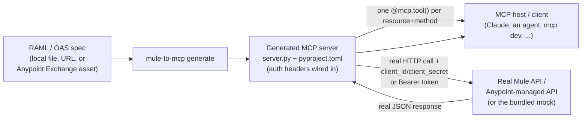

# mule-to-mcp

The MuleSoft-flavored sibling of [`openapi-to-mcp`](https://github.com/): turn a **RAML 1.0** spec (or an OpenAPI 3.x spec) into a working [MCP](https://modelcontextprotocol.io) server, in one command — understanding real-world Mule/Anypoint auth patterns (Client ID enforcement, OAuth2) along the way, not just a generic bearer token.

`mule-to-mcp generate` reads a RAML 1.0 or OpenAPI 3.x document (local file, URL, or pulled from Anypoint Exchange), auto-detects which format it is, and writes out a small, standalone, human-readable Python project: one MCP tool per resource+method, each making a real HTTP call to the real API with the auth headers a Mule-fronted API actually expects. No stubs, no mocking layer in the generated code.



## Quickstart

This walks through the exact bundled demo: a small "Orders" RAML API, protected by Anypoint-style **Client ID enforcement**, generated into a real MCP server, called for real — zero external accounts, zero Anypoint credentials required. Every command and every line of output below is a real captured run of this repository, not hand-written.

```bash
git clone <this-repo-url> mule-to-mcp
cd mule-to-mcp
python3 -m venv .venv && source .venv/bin/activate
pip install -e .
pip install "mcp[cli]"   # dep for the bundled demo client/server (flask is NOT needed — see note below)

# 1. Start the bundled mock Orders API (a real HTTP server, genuinely enforcing
#    the client_id / client_secret headers -- see "Why not Flask?" below)
MOCK_EXPECTED_CLIENT_ID=demo-client-id MOCK_EXPECTED_CLIENT_SECRET=demo-secret-xyz \
  python examples/orders_mock_api_server.py &

# 2. Generate an MCP server from its RAML spec
mule-to-mcp generate examples/orders_api.raml --out generated-orders-mcp \
  --auth-mode client-id --client-id-env ORDERS_CLIENT_ID --client-secret-env ORDERS_CLIENT_SECRET
```

Real captured output of step 2:

```
Detected format: RAML
Detected security: client-id — RAML securityScheme 'client_id_enforcement' (type 'x-custom') declares custom headers ['client_id', 'client_secret'] matching the Client ID enforcement pattern.
Generated MCP server for 'Orders API' -> generated-orders-mcp/
  base URL: http://127.0.0.1:8091
  4 operation(s) -> 4 tool(s):
    - list_orders
    - create_order
    - get_order_by_id
    - update_order_status
  auth: Client ID enforcement — headers 'client_id'/'client_secret' from $ORDERS_CLIENT_ID/$ORDERS_CLIENT_SECRET (set at runtime, not stored)

Next steps:
  cd generated-orders-mcp
  pip install -e .
  python server.py
```

```bash
# 3. Install the generated server (it's its own independent Python project)
cd generated-orders-mcp && pip install -e . && cd ..

# 4. Call its tools for real, over stdio, exactly as an MCP host would --
#    with the CORRECT credentials the mock API expects
export ORDERS_CLIENT_ID=demo-client-id
export ORDERS_CLIENT_SECRET=demo-secret-xyz
python examples/call_a_tool.py generated-orders-mcp/server.py
```

Real captured output of step 4 (against the live local mock API):

```
Discovered 4 tool(s): list_orders, create_order, get_order_by_id, update_order_status

>>> call_tool('list_orders', {})
{'status_code': 200, 'body': [{'id': 'o1', 'customerName': 'Ada Lovelace', 'status': 'PENDING', 'total': 42.5}, {'id': 'o2', 'customerName': 'Alan Turing', 'status': 'SHIPPED', 'total': 17.0}]}

>>> call_tool('get_order_by_id', {'order_id': 'o1'})
{'status_code': 200, 'body': {'id': 'o1', 'customerName': 'Ada Lovelace', 'status': 'PENDING', 'total': 42.5}}
```

Now the important negative test — **the same call with wrong credentials, proving the auth wiring is not a no-op**:

```bash
export ORDERS_CLIENT_ID=wrong-id
export ORDERS_CLIENT_SECRET=wrong-secret
python examples/call_a_tool.py generated-orders-mcp/server.py
```

Real captured output:

```
Discovered 4 tool(s): list_orders, create_order, get_order_by_id, update_order_status

>>> call_tool('list_orders', {})
{'status_code': 401, 'body': {'error': 'Unauthorized: missing or invalid client_id/client_secret'}}

>>> call_tool('get_order_by_id', {'order_id': 'o1'})
{'status_code': 401, 'body': {'error': 'Unauthorized: missing or invalid client_id/client_secret'}}
```

Missing credentials entirely (`unset ORDERS_CLIENT_ID ORDERS_CLIENT_SECRET`) produce the same `401` — the mock API genuinely checks both headers on every request, and the generated server genuinely reads them from the environment at call time and sends them on every request. That's the full chain, actually executed: **RAML spec → generated MCP tool → real HTTP call with real auth headers → real accept/reject decision → real JSON response.**

You can also point an MCP-aware client (or the [MCP Inspector](https://github.com/modelcontextprotocol/inspector)) straight at it:

```bash
cd generated-orders-mcp
mcp dev server.py     # interactive Inspector UI
# or
python server.py      # stdio transport, for an MCP host to launch directly
```

### Why not Flask for the mock API?

Anypoint's real Client ID enforcement policy uses headers literally named `client_id` / `client_secret` (underscored). Flask's built-in dev server (Werkzeug) **silently drops any incoming HTTP header whose name contains an underscore** — `werkzeug.serving.make_environ` does `if "_" in key: continue` as a guard against CGI/WSGI environ-variable spoofing ambiguity. That means a naively-built Flask mock would never see these headers at all, and the whole auth demo would silently "just work" without ever checking anything. `examples/orders_mock_api_server.py` is therefore built directly on Python's stdlib `http.server`, which exposes raw headers untouched — this was discovered and fixed during this project's own end-to-end verification, not assumed.

A second real gotcha found the same way: the MCP Python SDK's stdio transport does **not** inherit the parent process's full environment by default. `examples/call_a_tool.py` passes `env=dict(os.environ)` explicitly to `StdioServerParameters` for exactly this reason — omit it and the generated server's `ORDERS_CLIENT_ID`/`ORDERS_CLIENT_SECRET` never reach the child process, and every call fails closed with 401 even with the right values exported in your shell.

## How it works

**RAML 1.0 parsing** (`mule_to_mcp/raml_parser.py`). Confirmed against the current RAML 1.0 spec (`raml.org` and the `raml-spec` GitHub repo) before writing any parsing code:

- A document must start with the literal line `#%RAML 1.0`; everything after it is plain YAML.
- Resources are dict keys starting with `/` and nest arbitrarily (`/orders` → `/orders/{orderId}`); `uriParameters` (or a bare `{placeholder}`) become required path parameters.
- HTTP methods (`get`/`post`/`put`/`delete`/`patch`/...) under a resource carry `displayName`, `description`, `queryParameters`, `headers`, `body` (keyed by media type), and `securedBy`.
- `queryParameters`/`headers`/`uriParameters`/body `properties` support both RAML's compact shorthand (`name: string`) and full form (`name: {type: string, required: false}`), plus the `name?:` optional-key suffix.
- A method's `displayName` is used as the tool-name source (RAML has no `operationId`); falls back to method+path synthesis (`GET /orders/{orderId}` → `get_orders_by_order_id`) when absent.

**OpenAPI 3.x parsing** (`mule_to_mcp/oas_parser.py`) is a direct adaptation of `openapi-to-mcp`'s proven `parser.py` (local file/URL loading, local `#/...` `$ref` resolution with cycle protection), retargeted to feed the same shared `Operation` model — so RAML and OpenAPI specs go through **one identical codegen path** (`mule_to_mcp/codegen.py`). `mule-to-mcp` auto-detects which format a spec is from its content (`#%RAML 1.0` header vs. an `openapi:`/`swagger:` key) — you never have to say which.

**Mule-specific auth detection & wiring** (`mule_to_mcp/auth.py`). Both parsers additionally expose a `detect_security()` that inspects `securitySchemes` (RAML) or `components.securitySchemes`/`security` (OAS) and guesses one of:

- **Client ID enforcement** — two custom headers whose names both contain "client" and either "id" or "secret" (RAML `type: x-custom` with `describedBy.headers`, or OAS `apiKey`-in-header schemes). The two **exact header names are always configurable** via `--client-id-header`/`--client-secret-header` (default `client_id`/`client_secret`, matching Anypoint's own default policy naming — override to `X-ANYPOINT-CLIENT-ID`/`X-ANYPOINT-CLIENT-SECRET` or whatever your org uses).
- **OAuth 2.0** — RAML `type: OAuth 2.0` or OAS `oauth2`/`http bearer` schemes.
- **none** — no `securitySchemes` present.

`--auth-mode auto` (the default) uses this detection; pass `--auth-mode client-id|oauth2|none` to force it explicitly regardless of what was detected. The generated server then:
  - **`client-id`**: reads two env vars (`--client-id-env`/`--client-secret-env`, default `ANYPOINT_CLIENT_ID`/`ANYPOINT_CLIENT_SECRET`) **at call time** and sends them as the two configured headers on every request.
  - **`oauth2`**: reads one env var (`--bearer-token-env`, default `MULE_BEARER_TOKEN`) at call time and sends `Authorization: Bearer <token>`. This is header pass-through only — see Limitations.
  - **`none`**: sends no auth headers.

In every mode, only the **name** of the environment variable is baked into the generated code — never a value. Verified live (see Quickstart): a server generated with `--auth-mode client-id` genuinely sent the right headers, the mock API genuinely checked them, and both the accept and reject paths were exercised for real.

**Operation → tool mapping** (`mule_to_mcp/codegen.py`, adapted from `openapi-to-mcp`'s codegen): one `@mcp.tool()`-decorated function per (path, method), with typed, named parameters for path/query/header params (required first, optional defaulting to `None`), a single `body: dict[str, Any]` for request bodies, and a shared `_call_api()` helper doing the real `requests` call. The MCP server pattern itself (`from mcp.server import MCPServer`, `@mcp.tool(name=..., description=...)`, `mcp.run()`) was confirmed directly against the installed `mcp` package (v2.2.0, via `inspect.signature`) before writing any codegen — the exact same confirmed-correct pattern already verified live in `openapi-to-mcp`, reused here rather than re-derived.

## Exchange-pull mode (best-effort, unverified)

```bash
ANYPOINT_CLIENT_ID=... ANYPOINT_CLIENT_SECRET=... \
  mule-to-mcp generate --exchange-asset <groupId>/<assetId>/<version> --out generated-mcp
```

**This mode could not be tested live — there are no Anypoint Platform credentials in this environment.** It is implemented against the following researched-but-incomplete picture of the Anypoint Exchange API, and `mule_to_mcp/exchange_client.py` documents every assumption inline. Confirmed via `docs.mulesoft.com/exchange/exchange-api` and MuleSoft's public Exchange Experience API docs (fetched during this project's research phase):

- Assets are addressed by `groupId`/`assetId`/`version`.
- The Exchange API v2 base path for an asset is `https://anypoint.mulesoft.com/exchange/api/v2/organizations/{orgId}/assets/{groupId}/{assetId}/{version}` (confirmed for **publishing**; no public GET-for-download endpoint shape was found, so the GET path used here — `.../exchange/api/v2/assets/{groupId}/{assetId}/{version}` without the org segment — is extrapolated by analogy, not confirmed).
- Authenticating with a connected app ultimately produces a bearer token sent as `Authorization: bearer <token>` on every call (confirmed).

**Explicitly assumed, NOT confirmed**, because no public documentation page describing them was found in the time available:

1. A `client_credentials`-style token endpoint exists at `https://anypoint.mulesoft.com/accounts/api/v2/oauth2/token` accepting `client_id`/`client_secret`/`grant_type` and returning `{"access_token": "..."}`.
2. A GET on the asset URL returns metadata with a `files` array, each entry having a `classifier` (e.g. `"raml"`, `"oas"`, `"fat-raml"`) and an `externalLink`/`downloadURL` pointing at the actual spec file.
3. Only a single self-contained spec file is handled — a RAML "fat archive" (a zip of the root RAML plus `!include`d fragments) is **not** unzipped; this generator's RAML parser only supports self-contained, single-file RAML anyway (see Limitations).

If any assumption is wrong, `ExchangeError` surfaces the real HTTP status and response body rather than failing silently, so a user with real Anypoint access has a concrete starting point to fix it. Treat this feature as "shaped like it should work," not "known to work" — **the local-file/URL pipeline above is the fully verified path.**

## Project layout

```
mule_to_mcp/          the generator (this package)
  model.py               shared Operation/Parameter/DetectedSecurity model
  raml_parser.py          RAML 1.0 -> the shared model
  oas_parser.py            OpenAPI 3.x -> the shared model (adapted from openapi-to-mcp)
  auth.py                   Client-ID / OAuth2 header-injection code generation
  exchange_client.py         best-effort Anypoint Exchange asset fetch (unverified)
  codegen.py                  renders server.py / pyproject.toml / README.md
  cli.py                       `mule-to-mcp generate ...`
examples/
  orders_api.raml           demo RAML spec: list/create/get orders, update status
  orders_mock_api_server.py  stdlib-http.server mock enforcing client_id/client_secret
  call_a_tool.py              minimal MCP client that calls a generated server
tests/                     offline unit tests (RAML parsing, auth codegen, full codegen)
```

## Limitations

Be aware of what this does **not** do:

- **RAML 1.0 subset only.** No `!include`, no `uses:` (libraries), no `traits`/`resourceTypes`, no multi-file specs — a RAML file must be self-contained. `types:` resolution is one level of named-type lookup, not full inheritance/composition.
- **OAuth2 is header pass-through only.** No token acquisition, no refresh, no flow of any kind — you obtain a valid access token yourself and export it; the generated server just forwards it as `Authorization: Bearer <token>`.
- **Exchange-pull mode is unverified best-effort**, as disclosed above in detail.
- **OpenAPI 3.0.x/3.1.x subset only** (matching `openapi-to-mcp`): no Swagger 2.0, local `$ref` resolution only, no `oneOf`/`anyOf`/`allOf` composition.
- **Request bodies are one opaque `dict`**, not exploded fields.
- **Client ID enforcement detection is heuristic**: it looks for two headers whose names both contain "client" plus "id"/"secret". An org using very different header names will need `--client-id-header`/`--client-secret-header` (or `--auth-mode client-id` explicitly) rather than relying on `auto`.
- **No pagination, retries, rate-limit handling, or cookie parameters** in generated client code — one `requests.request(...)` call per tool invocation.
- **Single base URL.** RAML's `baseUri` (with simple `{version}` substitution) or OAS's `servers[0].url` — no per-environment server selection.

If your spec needs any of the above, treat the generated `server.py` as a starting point to hand-edit, not a black box.

## License

MIT — see [LICENSE](LICENSE).
