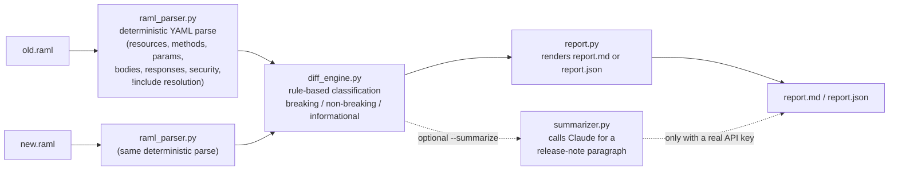

# raml-guard

A CI-gating CLI for MuleSoft API governance. It diffs two versions of a
RAML 1.0 spec and classifies every detected change as **breaking**,
**non-breaking**, or **informational**, so a spec author never accidentally
ships a breaking change to Anypoint Exchange consumers.

```
raml-guard diff old.raml new.raml --out report.md [--fail-on breaking|any] [--format md|json]
```

Run it as a CI step before publishing a new API version: it exits non-zero
the moment a breaking change is detected (the default `--fail-on breaking`),
so a pipeline can gate the publish step on it.

## The core diff engine needs zero API key and zero network

This is the whole point of the tool, and it's worth stating plainly: `raml_parser.py`
and `diff_engine.py` -- the code that actually decides `diff`'s exit code --
never import `anthropic`, never make an HTTP request, and never depend on
any external service. They're pure, deterministic Python over a YAML parse.
Run `raml-guard diff` on an airplane with no network and it works exactly
the same as it does anywhere else, every time, byte-for-byte the same
output for the same two input files (see `test_diff_is_deterministic_across_runs`
in `tests/test_diff_engine.py`, and the "AI never imported" regression test
in `tests/test_cli.py`). The only optional exception is `--summarize`/`explain`,
covered honestly below.

## How it works



Steps 1-3 (parse, parse, diff) never touch a network or an LLM and are
covered by 58 offline pytest tests. Step 4 (report rendering) is also
pure/offline. The dashed step is the one and only optional, network-touching
piece, off unless you pass `--summarize` or run `raml-guard explain`.

### The classification rules, and why

The full reasoning for every rule lives as a docstring at the top of
`raml_guard/diff_engine.py` -- read it there for the complete list with
justification for each one. Summary:

**Breaking** (a consumer built against the old spec would now fail against
the new one):
- A resource or method is removed.
- A query/header/path parameter changes from optional to required, or a
  *new* required parameter is added (either way, an old request that never
  sent it is now invalid).
- A body/response object field is removed, or its type is *narrowed*
  (`string` -> `integer`) or changed in an unrecognized way (treated
  conservatively as breaking by default).
- A request body field changes from optional to required, or a new
  *required* field is added to a request body.
- An enum value is removed from an accepted set.
- A previously-supported response status code is removed.
- Security is added where none existed, or an additional scheme is layered
  onto an already-secured endpoint.
- A request body media type is no longer accepted.

**Non-breaking** (additive/safe):
- A new resource, method, or optional parameter is added.
- A new field is added to a *response* body -- even if it's marked required
  in the new schema, since that only means "the server now always includes
  it," which doesn't break a consumer that was ignoring it.
- A new enum value is added (widening).
- A new response status code is added.
- A type is *widened* in a recognized-safe direction (`integer` -> `number`,
  `integer`/`number`/`boolean` -> `string`).
- A parameter or request-body field goes from required to optional.
- Description-text-only changes.
- Security is removed entirely (the endpoint becomes fully open).

**Informational** (a real change, but not cleanly safe or breaking --
flagged for a human, not auto-classified either way):
- A display name changes (cosmetic, distinct from a `description` change).
- A default value changes.
- A query/header parameter is removed (unlike a body field, a server
  generally just ignores an extra query param a client keeps sending, but
  this tool can't prove that for your specific gateway).
- A response body field goes from required to optional (still present, but
  a consumer that assumed it was always there should double check).
- One security scheme is dropped from a multi-scheme list while at least
  one other still applies.
- An `!include` reference changes to a different target, or a schema's
  resolvability changes between opaque and inline -- see below.

### `!include` handling

RAML types/traits are frequently split into separate files with
`!include path/to/file.raml`. `raml_parser.py` resolves each `!include`
**relative to the directory of the file that contains it** (so a nested
include inside an already-included file resolves relative to *that* file's
own directory, not the original entry point) -- verified in
`test_nested_include_resolves_relative_to_its_own_directory`. It handles
both RAML/YAML fragments (with or without their own `#%RAML 1.0` header)
and plain JSON Schema fragments (`.json`).

When a reference can't be resolved -- the file doesn't exist, fails to
parse, or nesting goes too deep (depth limit: 10) -- the parser does **not**
crash and does **not** guess at a shape. It falls back to an opaque marker
(`{"type": "opaque", "ref": "<original path>"}`) and records the path in
`spec.unresolved_includes`. `diff_engine.py` special-cases opaque nodes: it
never fabricates a diff about their internals. If both the old and new spec
have the same unresolved reference, no change is reported at all. If the
reference string itself changed, or a node flips between opaque and
resolved, that's reported as a single **informational** note ("verify
manually") rather than a fake structural diff. `report.py` also surfaces
every unresolved reference from either spec in its own "Unresolved
`!include` references" section so nothing is silently swallowed.

## Real, actually-run output against the bundled examples

Three example RAML files are bundled under `examples/`, all describing the
same small Orders API (`GET /orders`, `GET /orders/{orderId}`,
`POST /orders`):

- `orders_api_v1.raml` -- the baseline.
- `orders_api_v2_breaking.raml` -- the same API with 4 deliberately seeded
  breaking changes: the whole `/orders/{orderId}` resource removed, the
  `status` query parameter on `GET /orders` changed from optional to
  required, the `SHIPPED` value removed from the `status` enum, and the
  `total` field narrowed from `number` to `integer`.
- `orders_api_v2_safe.raml` -- the same API with only additive changes: a
  new optional `sortBy` query parameter, a new `CANCELLED` enum value, a new
  optional `giftMessage` field, a new `202` response status, a new
  `DELETE /orders/{orderId}` endpoint, and a documentation-only description
  change.

This is the real, unedited output of running `raml-guard diff` against both
pairs in this repo, right now:

```
$ raml-guard diff examples/orders_api_v1.raml examples/orders_api_v2_breaking.raml --out examples/report_v1_vs_v2_breaking.md
raml-guard: breaking=7 non_breaking=0 informational=0
Wrote examples/report_v1_vs_v2_breaking.md
[exit code: 1]

$ raml-guard diff examples/orders_api_v1.raml examples/orders_api_v2_safe.raml --out examples/report_v1_vs_v2_safe.md
raml-guard: breaking=0 non_breaking=12 informational=0
Wrote examples/report_v1_vs_v2_safe.md
[exit code: 0]
```

Both `examples/report_v1_vs_v2_breaking.md` and `examples/report_v1_vs_v2_safe.md`
are checked into this repo exactly as produced by that run -- nothing hand-edited.
The breaking report correctly lists 7 findings: the resource removal, the
query parameter becoming required, and the shared `Order` type's enum
reduction and `total` narrowing reported once for *each* of its two usage
sites (`GET /orders` 200's array items, and `POST /orders` 201) -- see
"Limitations" for why a shared-type change reports once per usage site
rather than once per type. The safe report correctly finds **zero** breaking
changes and lists all 12 additive changes as non-breaking.

## Quickstart

```bash
git clone <this-repo> raml-guard
cd raml-guard
python3 -m venv .venv && source .venv/bin/activate
pip install -e ".[dev]"

raml-guard diff examples/orders_api_v1.raml examples/orders_api_v2_breaking.raml
raml-guard diff examples/orders_api_v1.raml examples/orders_api_v2_safe.raml
```

### CLI reference

```
raml-guard diff OLD.raml NEW.raml
  --out PATH           write the report here (default: stdout)
  --fail-on {breaking,any}
                        breaking (default): exit non-zero only on breaking changes
                        any: strict mode, exit non-zero on ANY change
  --format {md,json}   report format (default: md)
  --summarize          optional: append an AI-generated release-note paragraph
                        (requires ANTHROPIC_API_KEY + `pip install -e ".[llm]"`;
                        never affects the exit code)
  --model MODEL        override the Claude model for --summarize
                        (default: $ANTHROPIC_MODEL or claude-opus-5)

raml-guard explain REPORT.json
  --out PATH           write the summary here (default: stdout)
  --model MODEL        same as above
```

## Optional LLM enhancement: full disclosure

**This development environment has no `ANTHROPIC_API_KEY`, no `ant` CLI/OAuth
profile, and the `anthropic` Python package itself is not installed**
(all three checked directly: `env | grep -i anthropic` found nothing,
`which ant` found nothing, `python3 -c "import anthropic"` raised
`ModuleNotFoundError`). Per this project's own disclosure standard (matching
the sibling `dataweave-copilot`/`mule-flow-doctor` projects by the same
author), here is exactly what that means was verified and what wasn't:

- **Real and fully verified, for real, in this environment:** the entire
  `diff` command end-to-end against both example pairs above, all 55
  parser/diff-engine/CLI tests, and the CLI's `--fail-on`/`--format`/`--out`
  behavior. This is the part that matters for CI gating and it needed no
  credentials at all.
- **Verified with a stubbed client, not a real API call:** `tests/test_summarizer.py`
  injects a fake `anthropic` module into `sys.modules` (since the real
  package isn't even installed here) and asserts that `summarizer._call_claude`
  -- the exact function `--summarize`/`explain` use -- builds its prompt
  correctly from real `Change` objects, resolves the model name
  (`--model` override, then `$ANTHROPIC_MODEL`, then the `claude-opus-5`
  default), passes `thinking={"type": "adaptive"}`, and correctly extracts
  the text back out of the response. The "model output" in that test is a
  hand-written string, not a real Claude response.
- **Not run at all, disclosed as untested:** an actual network call to the
  real Anthropic API. `--summarize`/`explain` have not been exercised
  against a live model in this environment. If you have a real
  `ANTHROPIC_API_KEY`, `pip install -e ".[llm]"` and try
  `raml-guard diff old.raml new.raml --summarize` yourself -- the code path
  is real and unit-tested up to the API boundary, just not fired at the
  real boundary here.

This asymmetry is intentional and is the entire point of the architecture:
the core `diff` engine has no such excuse for being unverified (it needs no
credentials, so it was fully, actually run), while the optional AI paragraph
is explicitly a nice-to-have that a CI pipeline should never depend on.

## Tests

```
$ pytest tests/ -v
```

58 tests, all offline (no network/API calls except the deliberately stubbed
ones in `test_summarizer.py`, which inject a fake module and never touch a
real socket): RAML parsing of resources/methods/params/bodies/security,
`!include` resolution (including the nested-directory and JSON-Schema-fragment
cases, and the opaque fallback for missing includes), CLI exit-code/format
behavior, and -- the bulk of the suite -- every diff classification rule
above, including the two explicitly tricky cases called out in this
project's spec: adding an *optional* parameter must never be flagged
breaking, and adding a *required* one must always be. All 58 passed in this
environment:

```
============================== 58 passed in 0.13s ==============================
```

## Project layout

```
raml_guard/
  raml_parser.py   deterministic RAML 1.0 -> internal model parse, with !include resolution
  diff_engine.py   rule-based breaking/non-breaking/informational classification (the core logic)
  report.py        renders report.md / report.json from a list of Change objects
  cli.py           `raml-guard diff` / `raml-guard explain`
  summarizer.py    optional: calls the Anthropic API for a release-note paragraph
examples/
  orders_api_v1.raml               baseline Orders API
  orders_api_v2_breaking.raml      baseline + 4 seeded breaking changes
  orders_api_v2_safe.raml          baseline + 6 additive-only changes
  report_v1_vs_v2_breaking.md      real, checked-in output of `raml-guard diff` (7 breaking)
  report_v1_vs_v2_safe.md          real, checked-in output of `raml-guard diff` (0 breaking)
tests/
  test_raml_parser.py   parsing + !include resolution
  test_diff_engine.py   every classification rule, both directions
  test_cli.py           exit codes, --fail-on, --format, no-anthropic-import guard
  test_summarizer.py    stubbed-client coverage of the optional LLM path
```

## Limitations (honest)

- **RAML `traits` and `resourceTypes` are not expanded.** A method that
  only exists on a resource via a `resourceType` mixin (rather than being
  written directly under the resource) will not be seen by this parser.
  Most hand-authored governance-relevant RAML declares methods directly;
  heavily trait/resourceType-driven specs will need this added.
- **`uses:` (RAML libraries) are not resolved as a distinct construct.** A
  type referenced through a library prefix (`LibName.TypeName`) falls back
  to an open `object` shape, the same fallback used for any other
  unresolvable named type -- it won't crash, but it also won't be diffed
  field-by-field.
- **A shared named type is inlined at every usage site, so a change to it
  is reported once per usage, not once per type.** This is intentional (the
  actual contract at each endpoint did change), but it means the breaking
  example report above lists the same `total: number -> integer` narrowing
  twice (once for each of the two places `Order` is used as a response
  body in that example), not once. A future version could deduplicate by
  also reporting a single "type `Order` changed" summary line.
- **Type-change classification is a fixed, conservative table**
  (`classify_type_change` in `diff_engine.py`), not a full type-theory
  subsumption check. Any pair not explicitly listed as "widening" --
  including any `object`/`array` shape change -- is treated as breaking by
  default. This favors false positives (a human has to double check
  something arguably safe) over false negatives (a real break slipping
  through a CI gate), which is the right trade-off for a gate, but it means
  a genuinely-safe-but-unlisted type change will still fail the build.
- **OAS/Swagger JSON support is not implemented.** This was explicitly a
  stretch goal in the spec for this project, not a requirement, and no OAS
  parsing exists here -- `raml-guard` only understands RAML 1.0
  (`#%RAML 1.0` header) today.
- **RAML 0.8's `schema:` keyword (raw XSD/JSON Schema text) is not parsed
  field-by-field.** Only RAML 1.0's native `type:`/`properties:` shapes are
  structurally diffed.
- **The `!include` depth limit is 10.** A pathologically deep chain of
  nested includes beyond that falls back to opaque rather than resolving
  further; this is a deliberate safety valve against runaway recursion, not
  expected to matter for realistic specs.
- **The optional `--summarize`/`explain` LLM feature has not been run
  against a live Anthropic API in this environment** (see the disclosure
  section above) -- it has been verified with a stubbed client and unit
  tests up to the API boundary only.

## License

MIT License. Copyright (c) 2026 Srinivasarao Polagani. See `LICENSE`.
